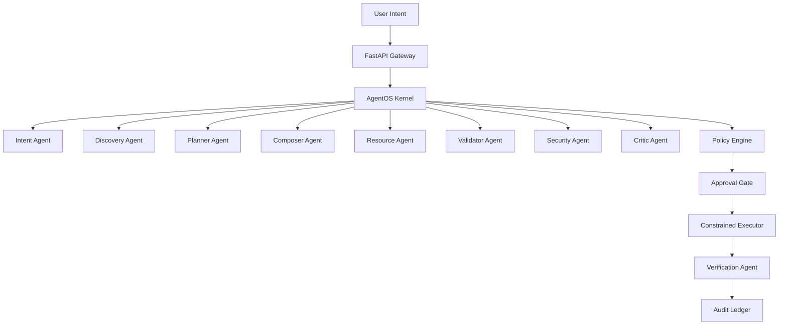

# Vulcan — AI-Governed Infrastructure Control Plane

> Converts natural-language infrastructure intent into approved, immutable, and verifiably executed automation — without fabricating success.

[](https://github.com/lavkushry/vulcan/actions/workflows/vulcan-ci.yml)

## Problem

Infrastructure automation today is either fully manual (slow, error-prone) or fully automated (risky, unauditable). Vulcan provides the governance layer: AI understands intent, selects automation, enforces approval policies, executes with cryptographic audit trails, and independently verifies results.

## What Makes Vulcan Different

- **Intent → Execution pipeline**: Natural language request → artifact selection → policy check → maker-checker approval → constrained execution → independent verification
- **Zero false success**: Every execution is independently verified against desired state. Missing metrics say "Not measured", not fabricated values.
- **Cryptographic audit trail**: SHA-256 hash-chained event log from genesis to tip, proving tamper-evident execution history.
- **Designed for regulated enterprise infrastructure**: Maker-checker separation of duties, environment isolation, capability-token-scoped execution.

## Quick Start

```bash
git clone https://github.com/lavkushry/vulcan.git
cd vulcan-control-plane
make demo
```

Or manually:

```bash
# Backend
cd backend && python -m venv .venv && source .venv/bin/activate
pip install -r requirements.txt
uvicorn app.main:app --port 8000

# Frontend (separate terminal)
cd frontend && npm install && npm run dev
```

Default demo credentials: `admin` / `vulcan-demo-2026`

## Architecture



## Test Results

| Suite | Result |
|---|---|
| Backend unit & integration tests | 615 passed, 9 skipped |
| 50-scenario evaluation framework | All scenarios pass |
| Frontend production build | 18 pages, 0 TypeScript errors |

## Design Inspirations

Vulcan's architecture draws from Clean Architecture (Robert C. Martin), large-scale system design patterns (Alex Xu), and declarative UI principles. All implementation is original work.

## Project Structure

```
vulcan-control-plane/
├── backend/          # FastAPI + AgentOS kernel, agents, adapters
│   ├── app/agentos/  # Multi-agent orchestration engine
│   ├── app/api/      # REST + WebSocket endpoints
│   └── tests/        # 615+ tests
├── frontend/         # Next.js 15 dashboard
├── deploy/           # Docker Compose + sandbox
└── docs/             # Architecture & operations guides
```

## Known Limitations

- Ansible execution requires `ansible-playbook` installed on the host or sandbox container
- Registry download falls back to cache when registry is unavailable
- Datadog monitoring integration is optional and runs in degraded mode when unconfigured
- Demo mode uses simulation adapters; production mode requires real infrastructure

## License

[MIT](LICENSE)
