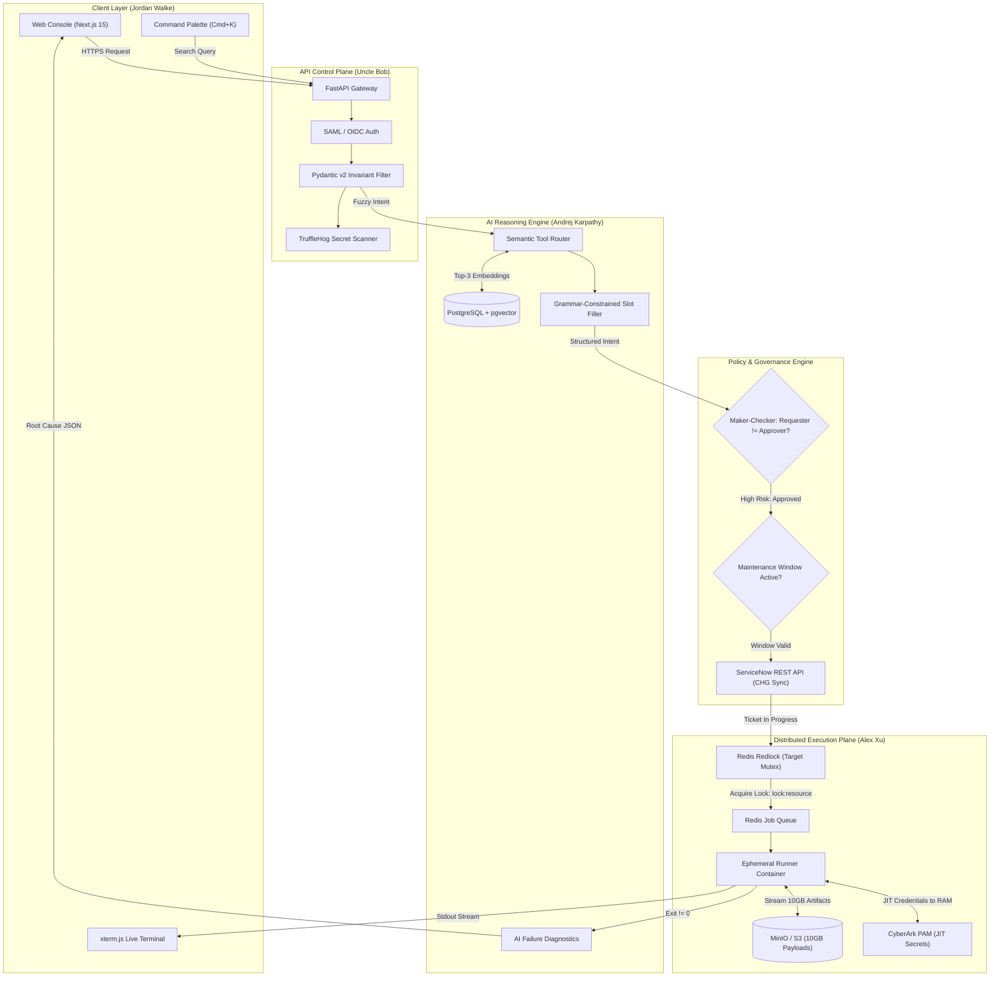
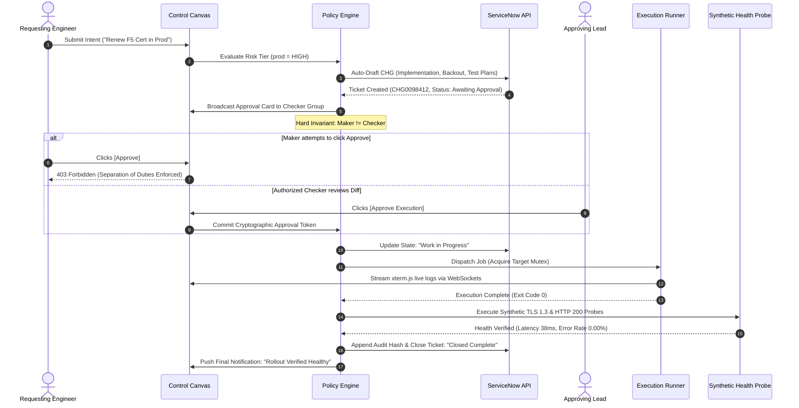
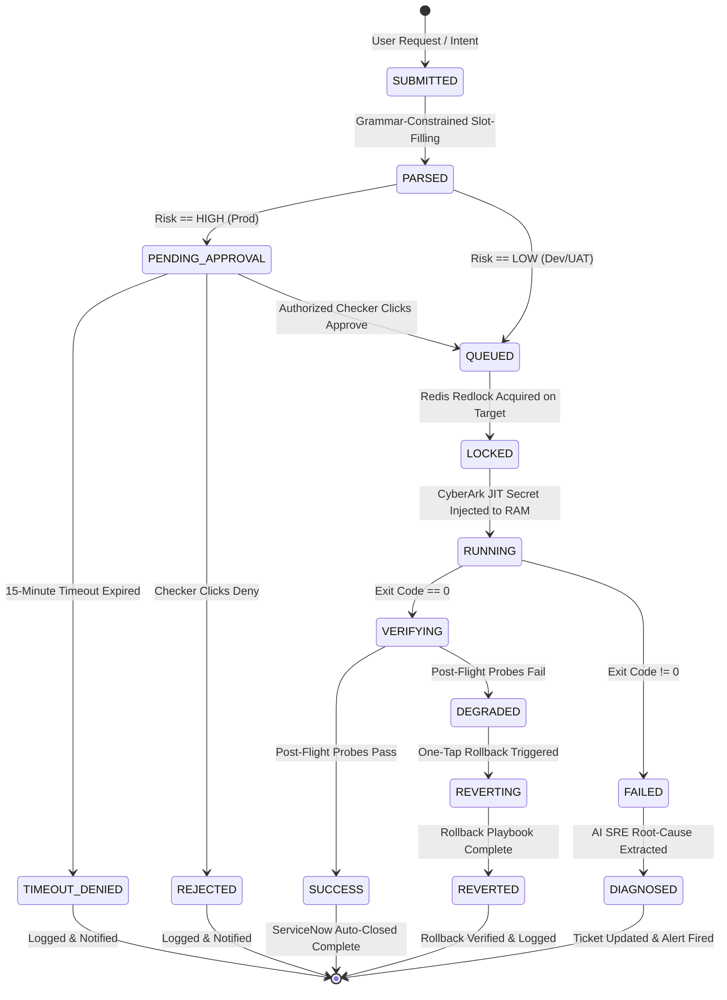
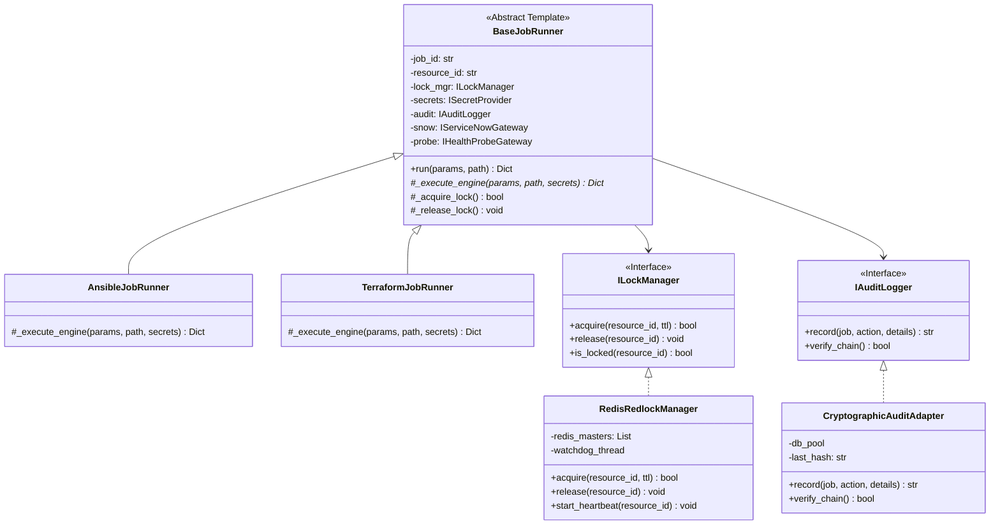

# THE DEFINITIVE MASTER SPECIFICATION: ENTERPRISE AUTOMATION CONTROL PLANE (PROJECT VULCAN)
## The Complete Architectural Blueprint, Month-Long Four-Agent Debate, High-Level Design, Low-Level Clean Python Architecture, and Declarative React Systems

**Chief Architect & Lead Chronicler:** Robert C. Martin ("Uncle Bob")  
**Co-Architects & Domain Specialists:** Alex Xu, Andrej Karpathy, Jordan Walke  
**Target Enterprise:** Mission-Critical Banking Infrastructure (PNC Bank Engineering Standard)  
**Document Status:** Approved Master Architecture & Engineering Specification (Version 5.0 — All-Inclusive)  

---

# TABLE OF CONTENTS
1. [PROLOGUE: THE FOUR ARCHITECTS & THE MANDATE](#part-i-the-four-architects--the-mandate)
2. [PART II: THE 30-DAY SCENARIO-BY-SCENARIO WAR ROOM DEBATE](#part-ii-the-30-day-scenario-by-scenario-war-room-debate)
   - [Scenario 1: Dynamic Discovery Across 1,000+ Scattered Playbooks](#scenario-1-dynamic-discovery-across-1000-scattered-playbooks)
   - [Scenario 2: Multi-Source Input Extraction & Dynamic Slot-Filling](#scenario-2-multi-source-input-extraction--dynamic-slot-filling)
   - [Scenario 3: Structured Configuration & JSON Payloads with Secret Linting](#scenario-3-structured-configuration--json-payloads-with-secret-linting)
   - [Scenario 4: Massive 10GB Binary Payloads & Large Artifact Decoupling](#scenario-4-massive-10gb-binary-payloads--large-artifact-decoupling)
   - [Scenario 5: Multi-Stage Governance, Maker-Checker & ServiceNow Sync](#scenario-5-multi-stage-governance-maker-checker--servicenow-sync)
   - [Scenario 6: Multi-Engine Execution & Terraform Plan-Diff-Apply Gate](#scenario-6-multi-engine-execution--terraform-plan-diff-apply-gate)
   - [Scenario 7: Asynchronous Observability & Eliminating the Babysitting Tax](#scenario-7-asynchronous-observability--eliminating-the-babysitting-tax)
   - [Scenario 8: AI SRE Failure Diagnostics & Root-Cause Analysis](#scenario-8-ai-sre-failure-diagnostics--root-cause-analysis)
   - [Scenario 9: Semantic Post-Flight Health Verification (Beyond Exit 0)](#scenario-9-semantic-post-flight-health-verification-beyond-exit-0)
   - [Scenario 10: Cryptographic Audit Trail, Merkle Hash Chaining & SIEM](#scenario-10-cryptographic-audit-trail-merkle-hash-chaining--siem)
3. [PART III: SYSTEM ARCHITECTURE INFOGRAPHICS](#part-iii-system-architecture-infographics)
4. [PART IV: COMPREHENSIVE MERMAID FLOWCHARTS & DIAGRAMS](#part-iv-comprehensive-mermaid-flowcharts--diagrams)
   - [1. End-to-End System Request Flow](#1-end-to-end-system-request-flow)
   - [2. Maker-Checker & ServiceNow Lifecycle Sequence](#2-maker-checker--servicenow-lifecycle-sequence)
   - [3. Finite State Machine (Job Execution Lifecycle)](#3-finite-state-machine-job-execution-lifecycle)
   - [4. Decoupled Data vs. Control Plane Flowchart (10GB S3 Upload)](#4-decoupled-data-vs-control-plane-flowchart-10gb-s3-upload)
   - [5. Clean Architecture Component & Port-Adapter Diagram](#5-clean-architecture-component--port-adapter-diagram)
   - [6. Python Class Diagram (LLD Domain & Adapters)](#6-python-class-diagram-lld-domain--adapters)
5. [PART V: HIGH-LEVEL DESIGN (HLD) & DISTRIBUTED SYSTEMS SIZING](#part-v-high-level-design-hld--distributed-systems-sizing)
   - [1. Back-of-the-Envelope Capacity Calculations (Alex Xu)](#1-back-of-the-envelope-capacity-calculations-alex-xu)
   - [2. Distributed Target Mutex (5-Node Redlock + Watchdog Heartbeat)](#2-distributed-target-mutex-5-node-redlock--watchdog-heartbeat)
   - [3. Complete Database Schema & DDL (PostgreSQL 16 + pgvector HNSW)](#3-complete-database-schema--ddl-postgresql-16--pgvector-hnsw)
   - [4. REST API & WebSocket Streaming Frame Protocol](#4-rest-api--websocket-streaming-frame-protocol)
6. [PART VI: LOW-LEVEL DESIGN (LLD) IN PYTHON (UNCLE BOB)](#part-vi-low-level-design-lld-in-python-uncle-bob)
   - [1. Pure Domain Entities & Invariants (`domain/entities.py`)](#1-pure-domain-entities--invariants-domainentitiespy)
   - [2. Custom Domain Exception Hierarchy (`domain/exceptions.py`)](#2-custom-domain-exception-hierarchy-domainexceptionspy)
   - [3. Abstract Ports / Interfaces (`domain/ports.py`)](#3-abstract-ports--interfaces-domainportspy)
   - [4. The Master Template Method Runner (`use_cases/runner.py`)](#4-the-master-template-method-runner-use_casesrunnerpy)
   - [5. Concrete Adapters (Ansible, Redlock, S3, CryptoAudit)](#5-concrete-adapters-ansible-redlock-s3-cryptoaudit)
   - [6. 18-Test PyTest Invariant Suite (`tests/test_invariants.py`)](#6-18-test-pytest-invariant-suite-teststest_invariantspy)
7. [PART VII: THE AI REASONING SUBSYSTEM & LLM OS (ANDREJ KARPATHY)](#part-vii-the-ai-reasoning-subsystem--llm-os-andrej-karpathy)
   - [1. Tokenomics & Working Memory (RAM) Budget](#1-tokenomics--working-memory-ram-budget)
   - [2. Two-Stage Hybrid Vector Search (pgvector HNSW + BM25)](#2-two-stage-hybrid-vector-search-pgvector-hnsw--bm25)
   - [3. Grammar-Constrained Decoding (Pydantic FSM Logit Masks)](#3-grammar-constrained-decoding-pydantic-fsm-logit-masks)
   - [4. Software 1.0 Windowing & Fast SRE Diagnostic Engine](#4-software-10-windowing--fast-sre-diagnostic-engine)
   - [5. 500-Scenario Golden Evaluation Benchmark](#5-500-scenario-golden-evaluation-benchmark)
8. [PART VIII: DECLARATIVE OBSIDIAN GLASS FRONTEND (JORDAN WALKE)](#part-viii-declarative-obsidian-glass-frontend-jordan-walke)
   - [1. Declarative State Model: $UI = f(\text{state})$](#1-declarative-state-model-ui--fstate)
   - [2. Obsidian Glass Design Tokens & Visual Hierarchy](#2-obsidian-glass-design-tokens--visual-hierarchy)
   - [3. Adaptive Bento Canvas & Slot-Filling Micro-Cards](#3-adaptive-bento-canvas--slot-filling-micro-cards)
   - [4. Universal Command Palette (`Cmd + K`)](#4-universal-command-palette-cmd--k)
   - [5. WebGL-Accelerated `xterm.js` Live Streaming at 60 FPS](#5-webgl-accelerated-xtermjs-live-streaming-at-60-fps)
   - [6. Maker-Checker Anti-Self-Approval Deck](#6-maker-checker-anti-self-approval-deck)
9. [PART IX: CONCLUSION & SIGN-OFF](#part-ix-conclusion--sign-off)

---

# PART I: THE FOUR ARCHITECTS & THE MANDATE
*Recorded by Robert C. Martin ("Uncle Bob")*

PNC Bank owns hundreds to thousands of battle-tested Ansible playbooks, Terraform modules, and operational scripts. However, they are trapped in silos, triggered manually from terminal bastions, and require 10 to 30 minutes of tethered babysitting per execution.

To fix this, four distinct disciplines gathered to create the definitive architecture for **Project Vulcan (Enterprise Automation Control Plane)**:

1. **Robert C. Martin ("Uncle Bob"):** Enforcer of Clean Architecture, SOLID, test-driven design, and strict boundaries separating deterministic domain rules from external delivery frameworks.
2. **Alex Xu:** Master of Distributed Systems (ByteByteGo), capacity math, Little's Law, 5-node Redis Redlock mutexes, and 10GB S3 chunked multipart upload decoupling.
3. **Andrej Karpathy:** Pioneer of the "LLM OS", working memory tokenomics, grammar-constrained decoding (FSM logit filters), and eval-driven engineering.
4. **Jordan Walke:** Creator of React, architect of declarative reactive state ($UI = f(state)$), 60 FPS WebGL terminal streaming, and the Obsidian Glass design system.

---

# PART II: THE 30-DAY SCENARIO-BY-SCENARIO WAR ROOM DEBATE

---

### Scenario 1: Dynamic Discovery Across 1,000+ Scattered Playbooks

* **Andrej Karpathy:**  
  "We have over 1,000 playbooks scattered across Bitbucket and GitHub repositories. In legacy platforms, you either build 1,000 static forms or force engineers to memorize CLI file paths. If you try to dump 1,000 schemas into an LLM prompt, you blow up your context window, latency spikes to 10 seconds, and attention degradation causes hallucinations.  
  My proposal: **A Two-Stage Hierarchical Vector Search Engine**. We embed the title, tags, and description of every playbook using `text-embedding-3-small` (1536 dimensions) and store them in PostgreSQL with `pgvector`. A user types: *'drain traffic from Dallas datacenter'*, and in $<15\text{ms}$ we run a cosine similarity query to extract the top 3 playbooks."

* **Uncle Bob:**  
  "Wait just a minute, Andrej! What does this vector query return? A floating pointer to a Git branch? What happens when an engineer triggers `f5_drain.yml` on `main`, but another engineer pushed an unreviewed, broken commit to `main` two minutes prior? Production drops, and your AI helped cause an outage!  
  A catalog item **must be immutable**. The Open/Closed Principle demands that once a playbook is verified, its reference cannot mutate. Every catalog item in PostgreSQL must be bound to a **40-character immutable Git Commit SHA** (`git_commit_sha`). If you update the playbook in Git, that is a *new* catalog registration event. No floating branch references, ever!"

* **Alex Xu:**  
  "Bob is completely right on Git immutability. But Andrej, pure dense vector search will fail on exact network identifiers. If an engineer searches for `pnc-f5-vip-04`, an embedding model maps semantic concepts, not exact string matches.  
  We must implement **Reciprocal Rank Fusion (RRF) Hybrid Search**:
  $$\text{RRF Score}(d) = \frac{0.6}{60 + \text{rank}_{\text{dense}}(d)} + \frac{0.4}{60 + \text{rank}_{\text{sparse}}(d)}$$
  We combine `pgvector` cosine similarity with a PostgreSQL `tsvector` GIN index for BM25 keyword matching. Furthermore, to prevent database thrashing at 500 RPS, we cache the top-100 playbooks in Redis with an LRU eviction policy, invalidated only when our GitSync webhook receives a verified commit."

* **Jordan Walke:**  
  "And on the client side, this discovery must feel instantaneous. No dropdown menus, no loading spinners. We implement a universal **Command Palette (`Cmd + K`)**.  
  As the engineer types, the UI queries the local in-memory trie cache in $<2\text{ms}$, falling back to a debounced 150ms stream to the hybrid vector API. The Bento Grid updates with zero layout shift, highlighting tags, risk tiers, and execution engines instantly."

* **Consensus Resolution:** GitSync service parses `metadata.yaml` $\rightarrow$ binds to immutable Git commit SHAs $\rightarrow$ generates vector embeddings stored in `pgvector` with an HNSW index $\rightarrow$ hybrid RRF search (Dense + BM25) cached in Redis $\rightarrow$ instant 60 FPS presentation via Jordan's `Cmd + K` Command Palette.

---

### Scenario 2: Multi-Source Input Extraction & Dynamic Slot-Filling

* **Uncle Bob:**  
  "Let's talk about parameters. A user types: *'Expand `/data` by 50GB on `pnc-db-01`'*. If the user forgets to specify the environment (`dev` vs `prod`), what does your AI do? If it guesses `prod` because the user works in prod, you've violated the first rule of software safety. Unvalidated input must never cross the domain boundary into an execution runner!"

* **Andrej Karpathy:**  
  "The AI never guesses defaults. That is why we use **Grammar-Constrained Decoding**. We compile our Pydantic JSON schema into a Finite State Machine (FSM) at the logit filter layer. If a required field is missing, the model is mathematically prohibited from outputting an execution payload. Instead, it emits:
  ```json
  {"status": "NEEDS_INPUT", "missing_fields": ["environment"]}
  ```
  The probability of emitting an unvalidated parameter is literally $0$."

* **Alex Xu:**  
  "And let's eliminate manual typing entirely when an enterprise ticket exists. If the engineer provides a ServiceNow ticket (`CHG0098412`), why ask them for the hostname or size? The API Gateway queries the ServiceNow REST API and internal CMDB in parallel:
  1. ServiceNow returns: `CI = pnc-db-01.bank.local`, `change_window = 02:00-04:00 EST`.
  2. CMDB returns: `IP = 10.240.12.5`, `VPC = vpc-prod-east`, `OS = RHEL 9.4`.
  The system auto-hydrates the parameters in $<250\text{ms}$, attaching a verified checkmark (`✓ CMDB Resolved`)."

* **Jordan Walke:**  
  "And when `NEEDS_INPUT` is returned, we don't present a 20-field blank form. The UI renders an **Adaptive Bento Micro-Card** that smoothly animates inline with numbered pills:
  `[1: DEV]` `[2: UAT]` `[3: PROD]`  
  The engineer presses hotkey `3`, the slot locks, and the card transitions to ready state in $<16\text{ms}$ using React 19 `useOptimistic`."

* **Consensus Resolution:** Pydantic FSM grammar constraints prevent guessing $\rightarrow$ automated parameter hydration from ServiceNow + CMDB $\rightarrow$ dynamic slot-filling micro-cards with hotkey navigation.

---

### Scenario 3: Structured Configuration & JSON Payloads with Secret Linting

* **Uncle Bob:**  
  "In network and firewall automation, playbooks require complex JSON configurations (routing policies, CIDR blocks, port arrays). The biggest operational hazard in enterprise IT is **accidental credential leakage**—a developer pastes a JSON config containing a hardcoded CyberArk password, private key, or AWS secret. The **Single Responsibility Principle** demands that parsing the configuration is completely isolated from security scanning."

* **Andrej Karpathy:**  
  "Furthermore, writing raw JSON in a terminal is error-prone. If an engineer says: *'Open port 443 and 80 from subnet 10.240.10.0/24'*, the AI should synthesize the schema-compliant JSON file for them, presenting it side-by-side for human verification."

* **Alex Xu:**  
  "We must enforce strict size bounds. In-memory JSON payloads must not exceed 5MB. Before the payload touches disk, it streams through an in-memory **TruffleHog / GitLeaks entropy scanner**. If high-entropy secrets are detected, the request is hard-blocked immediately with an alert directing the user to CyberArk JIT checkout."

* **Jordan Walke:**  
  "We embed the **Monaco Editor (VS Code in the browser)** with real-time AST schema validation. If an engineer pastes JSON with an unclosed brace or an illegal CIDR block, red squigglies appear instantly before they can even click Submit."

* **Consensus Resolution:** AI prompt-to-JSON synthesis + embedded Monaco editor with live AST schema linting $\rightarrow$ automated TruffleHog secret scanning $\rightarrow$ ephemeral sandboxed mount (`/runs/EXEC-XXXX/vars.json`, permissions `chmod 600`).

---

### Scenario 4: Massive 10GB Binary Payloads & Large Artifact Decoupling

* **Alex Xu:**  
  "This was our most critical systems clash. In banking, OS golden image provisioning or database restores require **10GB to 20GB binary files (ISOs, tar.gz dumps)**. If you attempt to upload 10GB through an HTTP POST to FastAPI, your gateway pods will crash with Out-Of-Memory errors, event loops will block, and Nginx will return 504 Gateway Timeouts."

* **Uncle Bob:**  
  "This is a blatant violation of the **Dependency Inversion Principle**. High-level automation orchestration should not depend on low-level byte transfer. The Control Plane must be completely decoupled from the Data Plane. The Orchestrator handles *pointers*; Object Storage handles *bytes*."

* **Andrej Karpathy:**  
  "And keep that 10GB binary 1,000 miles away from the LLM! The model only ever sees the URI string (`s3://...`) and the `SHA256` checksum."

* **Alex Xu:**  
  "Here is the exact distributed design:
  1. The browser requests an upload token from FastAPI.
  2. FastAPI invokes S3 `CreateMultipartUpload`, generating **205 presigned part URLs (50 MiB each)**.
  3. The browser uploads 50MB chunks directly to MinIO/S3 in parallel over 4–8 threads.
  4. If chunk 42 drops, only that 50MB chunk retries; the other 204 parts remain intact.
  5. The worker container pulls the binary directly from S3 across the internal 10 Gbps VPC network ($1.25\text{ GB/s} \implies 10\text{ GB}$ transferred in 8 seconds)."

* **Jordan Walke:**  
  "On the frontend, the engineer drags and drops the 10GB ISO into the Bento Canvas. The `@uppy/aws-s3-multipart` client streams chunks directly to storage, rendering a glowing neon circular progress ring with wire-speed throughput telemetry ($850\text{ MB/s}$)."

* **Consensus Resolution:** Decoupled Control/Data Plane $\rightarrow$ Client-direct S3 Presigned Multipart Uploads (50MB chunks) $\rightarrow$ Worker container streams directly from S3 at 10 Gbps wire speed $\rightarrow$ SHA256 integrity verification before execution.

---

### Scenario 5: Multi-Stage Governance, Maker-Checker & ServiceNow Sync

* **Uncle Bob:**  
  "In banking, **Separation of Duties (SoD)** is the law (SOX, OCC regulations). The person who writes or triggers a change cannot approve it. If Lavkush triggers a production run, the system must mathematically forbid Lavkush from approving it. Even if Lavkush has admin privileges, the API must return `403 Forbidden`."

* **Alex Xu:**  
  "We also have to handle approval timeouts. If an approval sits in Slack or Teams for 3 hours, the maintenance window might close. We enforce a **Fail-Closed 15-minute Circuit Breaker**. If an approver does not respond within 15 minutes, the request automatically aborts."

* **Andrej Karpathy:**  
  "And why are engineers spending 45 minutes manually filling out 20 boxes in ServiceNow? The AI reads the playbook metadata, parameters, and blast-radius score, and **auto-drafts the ServiceNow Change Request (CHG)** via REST API: Implementation Plan, Test Plan, and Back-out Plan are already written."

* **Jordan Walke:**  
  "On the UI, the approver sees a dedicated **Maker-Checker Review Deck**. If the logged-in user is the requester, the `[Approve]` button is rendered in a disabled acrylic state with a tooltip: *'Disabled: Requester cannot authorize own request'*. For valid checkers, one-tap approval with `Cmd + Enter` triggers execution."

* **Consensus Resolution:** AI auto-drafts ServiceNow CHG $\rightarrow$ Hard code-enforced Maker-Checker inequality (`requester_id != approver_id`) $\rightarrow$ 15-minute fail-closed timeout $\rightarrow$ Bi-directional ServiceNow sync auto-closing tickets upon verified completion.

---

### Scenario 6: Multi-Engine Execution & Terraform Plan-Diff-Apply Gate

* **Uncle Bob:**  
  "Ansible is imperative; Terraform is declarative. They have completely different lifecycles. We must use the **Strategy Pattern**. The core orchestrator interacts only with an `IExecutionEngine` port. `AnsibleRunnerAdapter` and `TerraformAdapter` implement the port independently."

* **Alex Xu:**  
  "Terraform cannot be run blind. You cannot just run `terraform apply`. You must run `terraform plan -out=tfplan.binary`, cache that exact binary plan in S3, and lock the Terraform state file in DynamoDB/Postgres. The apply step must execute *only* against that verified cached plan."

* **Andrej Karpathy:**  
  "And a human cannot read a 2,000-line raw HCL diff in 30 seconds. The AI parses `terraform show -json`, evaluates blast radius against security rules, and synthesizes a **3-Bullet Executive Diff Card**:  
  *`+3 Route Tables added, 0 destroyed. Compliant with Policy SEC-402.`*"

* **Jordan Walke:**  
  "The UI displays a side-by-side collapsible visual diff viewer with color-coded additions (emerald) and deletions (crimson), allowing the approver to sign off on the plan with 100% confidence."

* **Consensus Resolution:** Two-stage Terraform pipeline (`plan` $\rightarrow$ AST JSON diff parse $\rightarrow$ AI blast-radius summary $\rightarrow$ Checker approval $\rightarrow$ `apply` on cached binary plan).

---

### Scenario 7: Asynchronous Observability & Eliminating the Babysitting Tax

* **Uncle Bob:**  
  "Why do engineers babysit terminal progress bars for 20 minutes? Because they are terrified it will fail silently! To eliminate babysitting, we apply the **Observer Pattern**. The execution runner must decouple task execution from log broadcasting."

* **Alex Xu:**  
  "Technically, we dispatch the job to a distributed **Celery worker pool on Redis**. The runner pipes stdout events to a Redis Pub/Sub channel (`logs:EXEC-XXXX`). A lightweight async WebSocket gateway broadcasts events to active clients. If the engineer closes their laptop, the job continues safely in the background."

* **Jordan Walke:**  
  "And on the client, we embed **xterm.js** connected to the WebSocket. It renders terminal logs at 60 FPS without DOM lag, accompanied by a real-time Telemetry HUD showing CPU/Memory of the runner container and task milestones (`28/42 tasks passed`). When the job completes, background push notifications alert the engineer immediately."

* **Consensus Resolution:** Distributed Celery worker pool $\rightarrow$ Redis Pub/Sub stdout streaming $\rightarrow$ WebSocket `xterm.js` rendering $\rightarrow$ push alerts to Teams/Slack on terminal states. Active babysitting time reduced to **0 minutes**.

---

### Scenario 8: AI SRE Failure Diagnostics & Root-Cause Analysis

* **Uncle Bob:**  
  "When a playbook fails at task 37, a standard UI sends an email: *'Job Failed with Exit Code 2'*. That is useless. Now the engineer has to open a 5,000-line log file and spend 45 minutes finding what went wrong. But hear me clearly: the AI must **never** auto-apply fixes to production without human authorization!"

* **Andrej Karpathy:**  
  "Agreed. When `exit_code != 0`, our **Diagnostic SRE Agent** intercepts the failure. We pre-filter the log using Software 1.0 regex to locate the failed task and grab the surrounding 50 lines. The LLM extracts the root cause and outputs structured JSON: failed host, task name, and concrete remediation advice."

* **Jordan Walke:**  
  "On failure, an **Obsidian Diagnostic Drawer** slides smoothly from the right edge of the screen with haptic visual cues:  
  *`🔍 Root Cause: F5 rejected cert because private key passphrase did not match CyberArk safe.`*  
  *`💡 Remediation: Click [Sync CyberArk Vault] or [Trigger Rollback Playbook].`*"

* **Consensus Resolution:** Targeted log windowing (Software 1.0 pre-filter) $\rightarrow$ AI root-cause extraction in $<3$ seconds $\rightarrow$ slide-out Diagnostic Drawer with one-tap remediation triggers.

---

### Scenario 9: Semantic Post-Flight Health Verification (Beyond Exit 0)

* **Uncle Bob:**  
  "A green checkmark because an Ansible process returned exit code `0` is a lie. What if NGINX started, but the configuration syntax broke the upstream API? What if the SSL cert was bound, but TLS 1.0 is still open? **Exit 0 is a necessary condition, but it is not a sufficient condition for success.**"

* **Alex Xu:**  
  "We introduce a mandatory **Post-Flight Verification Phase**. The runner container does not terminate on exit code 0. It executes a suite of synthetic health probes: TLS 1.3 handshake verification, synthetic HTTP 200 GET requests against endpoints, and queries Prometheus/Datadog to verify error rates did not spike within 2 minutes post-change."

* **Jordan Walke:**  
  "In the UI, the status doesn't jump directly from RUNNING to SUCCESS. It transitions through a glowing amber **`VERIFYING_HEALTH`** pulse. Only when synthetic health probes pass does the badge turn Neon Emerald (`SUCCESS`). If health checks fail, the UI offers an immediate **[One-Tap Rollback]** button."

* **Consensus Resolution:** Mandatory post-execution synthetic probes (HTTP, TLS, metrics latency) $\rightarrow$ automated rollback prompt on health degradation.

---

### Scenario 10: Cryptographic Audit Trail, Merkle Hash Chaining & SIEM Mirroring

* **Uncle Bob:**  
  "In banking, an audit log that can be updated or deleted by a Database Administrator is invalid. The **Write-Before-Execute** rule is non-negotiable: the audit record must be committed to disk **before** the runner process spawns. If the server loses power a millisecond later, the record exists."

* **Alex Xu:**  
  "To prevent tampering, we implement **Cryptographic Hash Chaining (Merkle Tree / Blockchain-style)**. Every audit row contains its own payload hash plus the SHA256 hash of the previous row:  
  $$\text{Hash}_n = \text{SHA256}(\text{Record}_n + \text{Hash}_{n-1})$$  
  If a DBA tries to modify row 42, the hash chain breaks mathematically. Furthermore, a FluentBit daemon mirrors every audit row in real time to our enterprise **Splunk / Kafka WORM cluster**."

* **Andrej Karpathy:**  
  "And our automated CI/CD pipeline runs a verification grep test: zero plaintext passwords, API keys, or private keys can ever appear in the audit table or LLM context."

* **Consensus Resolution:** Synchronous write-before-execute $\rightarrow$ SHA256 Merkle hash chaining $\rightarrow$ real-time Splunk WORM mirroring $\rightarrow$ 10-second audit queryability for OCC/SOX regulators.

---

# PART III: SYSTEM ARCHITECTURE INFOGRAPHICS

### Infographic 1: Modern Cloud Control Plane Architecture


### Infographic 2: The Obsidian Glass Mission Control Canvas


### Infographic 3: Enterprise Banking Workflow & Governance State Machine


---

# PART IV: COMPREHENSIVE MERMAID FLOWCHARTS & DIAGRAMS

### 1. End-to-End System Request Flow



---

### 2. Maker-Checker & ServiceNow Lifecycle Sequence



---

### 3. Finite State Machine (Job Execution Lifecycle)



---

### 4. Decoupled Data vs. Control Plane Flowchart (10GB S3 Upload)

```mermaid
sequenceDiagram
    autonumber
    actor User as Engineer / Browser
    participant API as FastAPI Gateway
    participant S3 as MinIO / AWS S3 Object Storage
    participant Runner as Ephemeral Worker Container
    participant Target as Target Infrastructure Host

    Note over User,Target: Control Plane Handles Metadata; Storage Handles 10GB Bytes
    User->>API: 1. Request Presigned Upload (file_size: 10GB, sha256)
    API->>S3: 2. Generate S3 Multipart Presigned URLs (50MB chunks)
    S3-->>API: 3. Return Part URLs
    API-->>User: 4. Presigned URLs & Upload Token
    
    User->>S3: 5. PUT 50MB Chunks Directly to S3 in Parallel (Wire Speed)
    User->>S3: 6. Complete Multipart Upload Notification
    S3-->>API: 7. S3 Webhook: Upload Complete (URI: s3://staging/uuid/rhel-9.iso)
    
    API->>Runner: 8. Pass Pointer Reference & Expected Checksum
    Runner->>S3: 9. Stream Binary Directly over 10Gbps Storage Network
    Runner->>Target: 10. Pipe Image to Disk via optimized rsync / curl
    Runner->>Runner: 11. Verify SHA256 Checksum on Disk
```

---

### 5. Clean Architecture Component & Port-Adapter Diagram

```mermaid
flowchart TD
    subgraph EnterpriseBusinessRules ["Enterprise Business Rules (Core Domain)"]
        Entities["Domain Entities: ExecutionJob, CatalogItem, AuditRecord"]
        Invariants["Invariants: Maker-Checker, Regex, Secret Lint, Window Check"]
    end

    subgraph ApplicationBusinessRules ["Application Business Rules (Use Cases)"]
        ExecJob["ExecuteJobUseCase (Template Method)"]
        ApproveJob["ApproveJobUseCase"]
        ResolveIntent["ResolveIntentUseCase"]
        DiagFailure["DiagnoseFailureUseCase"]
    end

    subgraph InterfaceAdapters ["Interface Adapters (Ports & Adapters)"]
        EnginePort["<<port>> IExecutionEngine"]
        LockPort["<<port>> ILockManager"]
        AuditPort["<<port>> IAuditLogger"]
        StoragePort["<<port>> IObjectStorageGateway"]
        SNOWPort["<<port>> IServiceNowGateway"]

        AnsibleAdapter["AnsibleRunnerAdapter"]
        TerraformAdapter["TerraformAdapter"]
        RedlockAdapter["RedisRedlockAdapter"]
        CryptoAudit["CryptographicAuditAdapter"]
        S3Adapter["S3MultipartAdapter"]
        SNOWAdapter["ServiceNowRESTAdapter"]
    end

    subgraph FrameworksDrivers ["Frameworks & Drivers (Delivery & External)"]
        FastAPI["FastAPI Web Framework"]
        NextJS["Next.js 15 Web Console"]
        RedisCluster[("Redis 7.2 Cluster")]
        PostgresDB[("PostgreSQL 16 + pgvector")]
        S3Service[("MinIO / AWS S3")]
        CyberArkPAM["CyberArk PAM API"]
    end

    %% Clean Architecture Dependencies (Point Inward)
    Invariants --> Entities
    ExecJob --> Entities
    ExecJob --> Invariants
    ExecJob --> EnginePort
    ExecJob --> LockPort
    ExecJob --> AuditPort
    ExecJob --> StoragePort
    ExecJob --> SNOWPort

    AnsibleAdapter ..|> EnginePort
    TerraformAdapter ..|> EnginePort
    RedlockAdapter ..|> LockPort
    CryptoAudit ..|> AuditPort
    S3Adapter ..|> StoragePort
    SNOWAdapter ..|> SNOWPort

    FastAPI --> ExecJob
    FastAPI --> ApproveJob
    FastAPI --> ResolveIntent
    NextJS --> FastAPI
    RedlockAdapter --> RedisCluster
    CryptoAudit --> PostgresDB
    S3Adapter --> S3Service
    AnsibleAdapter --> CyberArkPAM
```

---

### 6. Python Class Diagram (LLD Domain & Adapters)



---

# PART V: HIGH-LEVEL DESIGN (HLD) & DISTRIBUTED SYSTEMS SIZING

### 1. Back-of-the-Envelope Capacity Calculations (Alex Xu)

```
┌───────────────────────────────────────┬────────────────────────────────────────────────┐
│ Metric                                │ Dimensioning Calculation                       │
├───────────────────────┬────────────────────────────────────────────────┤
│ Daily Execution Volume                │ 3,000 jobs / day                               │
│ Working Change Window                 │ 8 hours peak (28,800 seconds)                  │
│ Average Execution Duration (W)        │ 10 minutes (600 seconds)                       │
│ Max Job Duration (Timeout)            │ 60 minutes (3,600 seconds)                     │
│ Target Peak Concurrency (L)           │ 75 concurrent runner container pods            │
│ Stdout Log Rate per Active Run        │ 20 lines/sec @ 250 bytes/line = 5 KB/s (40Kbps)│
│ Ingress Log Bandwidth (75 runs)       │ 75 * 5 KB/s = 375 KB/s (3.0 Mbps)              │
│ WebSocket Fanout Egress Bandwidth     │ 75 * 1.5 terminals * 5 KB/s = 562.5 KB/s       │
│ Daily Raw Log Generation              │ 3,000 runs * 600s * 5 KB/s = 9.0 GB/day        │
│ Compressed S3 Archive (Zstandard 7:1) │ 9.0 GB / 7 = 1.28 GB/day (~470 GB/year)        │
│ Relational Database Growth            │ 20 KB/job * 3,000 = 60 MB/day (21.9 GB/year)   │
│ Worker Pod Compute Capacity           │ 75 vCPUs, 150 GiB RAM (4x c6i.8xlarge nodes)   │
└───────────────────────────────────────┴────────────────────────────────────────────────┘
```

#### Mathematical Proof of Little's Law:
$$L = \lambda \times W \implies \lambda_{\text{sustainable}} = \frac{75}{600\text{ s}} = 0.125\text{ jobs/sec} = 450\text{ jobs/hour}$$
Across an 8-hour change window: $450 \times 8 = 3,600\text{ jobs}$, providing a **20% headroom margin** over the 3,000 daily requirement.

---

### 2. Distributed Target Mutex (5-Node Redlock + Watchdog Heartbeat)

* **Vulnerabilities of Naive Locks:** Single-key Redis locks fail when runs exceed TTL (leading to split-brain execution) or when a worker crash deletes an active lock.
* **The Solution:**
  1. **5 Independent Redis Masters:** Distributed across 3 AWS Availability Zones / Datacenters. Quorum requires acquisition on $\ge 3$ nodes.
  2. **Background Watchdog Heartbeat Daemon:**
     - Initial lease TTL: $30,000\text{ ms}$ (30 seconds).
     - Daemon thread wakes up every $10\text{ seconds}$ ($\frac{TTL}{3}$).
     - Executes atomic `PEXPIRE` Lua script.
     - If the worker pod suffers an OOM kill or network cut, the heartbeat stops; the lock auto-expires in 30 seconds without deadlock.
  3. **Monotonic Fencing Tokens:** `INCR token:resource:{id}` guarantees downstream execution rejects stale operations.

---

### 3. Complete Database Schema & DDL (PostgreSQL 16 + pgvector HNSW)

```sql
CREATE EXTENSION IF NOT EXISTS "uuid-ossp";
CREATE EXTENSION IF NOT EXISTS "pgcrypto";
CREATE EXTENSION IF NOT EXISTS "vector";

-- 1. Automation Catalog (1,000+ items)
CREATE TABLE catalog_items (
    id UUID PRIMARY KEY DEFAULT gen_random_uuid(),
    identifier VARCHAR(100) UNIQUE NOT NULL,       -- e.g. "net-f5-cert-renew"
    name VARCHAR(255) NOT NULL,
    engine VARCHAR(50) NOT NULL,                   -- "ansible" | "terraform"
    git_repo VARCHAR(255) NOT NULL,
    git_path VARCHAR(255) NOT NULL,
    git_commit_sha VARCHAR(40) NOT NULL,           -- Immutable commit SHA
    rollback_path VARCHAR(255),
    risk_tier VARCHAR(20) NOT NULL DEFAULT 'HIGH', -- "LOW" | "MEDIUM" | "HIGH"
    requires_maker_checker BOOLEAN DEFAULT TRUE,
    requires_chg BOOLEAN DEFAULT TRUE,
    input_schema JSONB NOT NULL,                   -- Dynamic JSON Schema specification
    embedding vector(1536),                        -- pgvector for semantic discovery
    created_at TIMESTAMP WITH TIME ZONE DEFAULT NOW(),
    updated_at TIMESTAMP WITH TIME ZONE DEFAULT NOW()
);

-- HNSW Vector Index: Sub-5ms retrieval over 100k vectors
CREATE INDEX idx_catalog_embedding_hnsw 
ON catalog_items USING hnsw (embedding vector_cosine_ops) 
WITH (m = 16, ef_construction = 64);

-- 2. Execution Jobs State Table
CREATE TABLE execution_jobs (
    id UUID PRIMARY KEY DEFAULT gen_random_uuid(),
    correlation_id VARCHAR(50) UNIQUE NOT NULL,    -- e.g. "EXEC-0091"
    catalog_item_id UUID NOT NULL REFERENCES catalog_items(id),
    requester_id VARCHAR(100) NOT NULL,
    approver_id VARCHAR(100),
    target_resource_id VARCHAR(255) NOT NULL,      -- Mutex Key (e.g. "f5-vip-01")
    servicenow_chg VARCHAR(50),
    status VARCHAR(50) NOT NULL DEFAULT 'PENDING_APPROVAL',
    input_params JSONB NOT NULL DEFAULT '{}'::jsonb,
    storage_artifact_uri VARCHAR(512),             -- Pointer to 10GB S3 payload
    storage_artifact_sha256 VARCHAR(64),
    exit_code INT,
    error_message TEXT,
    ai_diagnostic JSONB,                           -- SRE root-cause output
    created_at TIMESTAMP WITH TIME ZONE DEFAULT NOW(),
    approved_at TIMESTAMP WITH TIME ZONE,
    executed_at TIMESTAMP WITH TIME ZONE,
    completed_at TIMESTAMP WITH TIME ZONE
);

CREATE INDEX idx_jobs_correlation_id ON execution_jobs(correlation_id);
CREATE INDEX idx_jobs_status ON execution_jobs(status);
CREATE INDEX idx_jobs_target ON execution_jobs(target_resource_id);

-- 3. Cryptographic Immutable Audit Ledger (Merkle Chain)
CREATE TABLE audit_ledger (
    id BIGSERIAL PRIMARY KEY,
    correlation_id VARCHAR(50) NOT NULL REFERENCES execution_jobs(correlation_id),
    timestamp TIMESTAMP WITH TIME ZONE DEFAULT NOW(),
    actor VARCHAR(100) NOT NULL,
    action VARCHAR(100) NOT NULL,
    payload JSONB NOT NULL,
    prev_hash VARCHAR(64) NOT NULL,                -- SHA256 Merkle Chain
    current_hash VARCHAR(64) NOT NULL              -- SHA256(payload + prev_hash)
);

CREATE INDEX idx_audit_correlation ON audit_ledger(correlation_id);
```

---

### 4. REST API & WebSocket Streaming Frame Protocol

#### REST Endpoints:
* `POST /api/v1/intent/resolve`: Body: `{"intent": "...", "context": {...}}` $\rightarrow$ Returns matched tool + validated JSON schema.
* `POST /api/v1/jobs`: Enqueues execution; performs pre-flight write-before-run audit.
* `POST /api/v1/jobs/{id}/approve`: Validates `requester_id != approver_id`; commits approval token.
* `POST /api/v1/jobs/{id}/rollback`: Dispatches verified inverse rollback playbook.
* `POST /api/v1/storage/presign`: Returns 205 presigned S3 multipart URLs for 10GB uploads.

#### WebSocket Live Frame Contract:
```json
{
  "event": "stdout" | "task_start" | "task_pass" | "task_fail" | "telemetry" | "diagnostic",
  "job_id": "EXEC-0091",
  "seq": 1402,
  "timestamp": "2026-09-05T10:30:00.123Z",
  "data": {
    "line": "\u001b[32mTASK [f5_ssl_renew : Bind Certificate] ***\u001b[0m\r\n",
    "cpu_pct": 14.2,
    "memory_mb": 420,
    "current_task": "Bind Certificate",
    "tasks_completed": 28,
    "tasks_total": 42
  }
}
```

---

# PART VI: LOW-LEVEL DESIGN (LLD) IN PYTHON (UNCLE BOB)

### 1. Pure Domain Entities & Invariants (`domain/entities.py`)

```python
from dataclasses import dataclass, field
from datetime import datetime
from enum import Enum
from typing import Any, Dict, List, Optional
import re

class JobStatus(str, Enum):
    SUBMITTED = "SUBMITTED"
    PARSED = "PARSED"
    PENDING_APPROVAL = "PENDING_APPROVAL"
    TIMEOUT_DENIED = "TIMEOUT_DENIED"
    REJECTED = "REJECTED"
    QUEUED = "QUEUED"
    LOCKED = "LOCKED"
    RUNNING = "RUNNING"
    VERIFYING = "VERIFYING"
    SUCCESS = "SUCCESS"
    FAILED = "FAILED"
    DEGRADED = "DEGRADED"
    REVERTING = "REVERTING"
    REVERTED = "REVERTED"

class RiskTier(str, Enum):
    LOW = "LOW"
    MEDIUM = "MEDIUM"
    HIGH = "HIGH"

class ExecutionEngineType(str, Enum):
    ANSIBLE = "ansible"
    TERRAFORM = "terraform"

@dataclass(frozen=True)
class CatalogItem:
    """Immutable Catalog Item bound to a specific Git Commit SHA."""
    id: str
    identifier: str
    name: str
    engine: ExecutionEngineType
    git_repo: str
    git_path: str
    git_commit_sha: str  # 40-character immutable SHA
    risk_tier: RiskTier
    requires_maker_checker: bool
    requires_chg: bool
    input_schema: Dict[str, Any]
    rollback_path: Optional[str] = None

@dataclass
class ExecutionJob:
    """Rich Aggregate Root enforcing domain invariants."""
    id: str
    correlation_id: str
    catalog_item: CatalogItem
    requester_id: str
    target_resource_id: str
    parameters: Dict[str, Any]
    status: JobStatus = JobStatus.SUBMITTED
    approver_id: Optional[str] = None
    approval_requested_at: Optional[datetime] = None
    servicenow_chg: Optional[str] = None
    storage_artifact_uri: Optional[str] = None
    storage_artifact_sha256: Optional[str] = None
    exit_code: Optional[int] = None
    created_at: datetime = field(default_factory=lambda: datetime.now(timezone.utc))
    completed_at: Optional[datetime] = None

    def enforce_maker_checker(self, approver_id: str, decided_at: Optional[datetime] = None, timeout_seconds: int = 900):
        """Hard Banking Invariant: Universal Maker-Checker across all risk tiers with transition guard."""
        if self.status != JobStatus.PENDING_APPROVAL:
            raise StateTransitionError(f"Cannot enforce maker-checker approval in state [{self.status.value}] (must be PENDING_APPROVAL).")
        
        now = decided_at or datetime.now(timezone.utc)
        if self.approval_requested_at:
            elapsed = (now - self.approval_requested_at).total_seconds()
            if elapsed > timeout_seconds:
                self.status = JobStatus.TIMEOUT_DENIED
                raise ApprovalTimeoutError("Approval timed out after 15 minutes. Automatically denied fail-closed.")
        
        if self.requester_id == approver_id:
            raise MakerCheckerViolationError(f"MakerCheckerViolation: Requester [{self.requester_id}] cannot approve own execution.")
        
        self.approver_id = approver_id
        self.status = JobStatus.QUEUED

    def check_approval_timeout(self, timeout_seconds: int = 900):
        """Fail-Closed 15-minute circuit breaker."""
        if self.status == JobStatus.PENDING_APPROVAL and self.approval_requested_at:
            elapsed = (datetime.now(timezone.utc) - self.approval_requested_at).total_seconds()
            if elapsed > timeout_seconds:
                self.status = JobStatus.TIMEOUT_DENIED
                raise ApprovalTimeoutError("Approval timed out after 15 minutes. Automatically denied.")
```

---

### 2. Custom Domain Exception Hierarchy (`domain/exceptions.py`)

```python
class DomainError(Exception):
    """Base domain exception."""
    pass

class MakerCheckerViolationError(DomainError):
    pass

class ApprovalTimeoutError(DomainError):
    pass

class MaintenanceWindowClosedError(DomainError):
    pass

class ParameterValidationError(DomainError):
    pass

class SecretLintError(DomainError):
    pass

class ResourceLockedError(DomainError):
    pass
```

---

### 3. Abstract Ports / Interfaces (`domain/ports.py`)

```python
import abc
from typing import Any, Callable, Dict, Optional
from domain.entities import ExecutionJob

class IExecutionEngine(abc.ABC):
    @abc.abstractmethod
    def execute(self, job: ExecutionJob, event_callback: Callable[[str], None], secrets: Dict[str, str]) -> int:
        pass

class ILockManager(abc.ABC):
    @abc.abstractmethod
    def acquire(self, resource_id: str, ttl_seconds: int = 1800) -> bool:
        pass

    @abc.abstractmethod
    def release(self, resource_id: str) -> None:
        pass

class IAuditLogger(abc.ABC):
    @abc.abstractmethod
    def record(self, job: ExecutionJob, action: str, details: Dict[str, Any]) -> str:
        pass

class ISecretProvider(abc.ABC):
    @abc.abstractmethod
    def checkout_ephemeral_secret(self, target: str) -> Dict[str, str]:
        pass

class IServiceNowGateway(abc.ABC):
    @abc.abstractmethod
    def is_within_maintenance_window(self, chg_number: str) -> bool:
        pass

    @abc.abstractmethod
    def update_work_notes(self, chg_number: str, notes: str, new_state: Optional[str] = None):
        pass

class IHealthProbeGateway(abc.ABC):
    @abc.abstractmethod
    def probe(self, job: ExecutionJob) -> bool:
        pass
```

---

### 4. The Master Template Method Runner (`use_cases/runner.py`)

```python
import abc
from domain.entities import ExecutionJob, JobStatus
from domain.exceptions import ResourceLockedError, MaintenanceWindowClosedError
from domain.ports import (
    IExecutionEngine, ILockManager, IAuditLogger,
    ISecretProvider, IServiceNowGateway, IHealthProbeGateway
)

class BaseJobRunner:
    """
    Template Method Pattern: Enforces the immutable banking safety sequence.
    """
    def __init__(
        self,
        engine: IExecutionEngine,
        lock_mgr: ILockManager,
        audit: IAuditLogger,
        secrets: ISecretProvider,
        snow: IServiceNowGateway,
        probe: IHealthProbeGateway,
        broadcaster: Any
    ):
        self.engine = engine
        self.lock_mgr = lock_mgr
        self.audit = audit
        self.secrets = secrets
        self.snow = snow
        self.probe = probe
        self.broadcaster = broadcaster

    def run(self, job: ExecutionJob):
        # 1. Maintenance Window Verification
        if job.servicenow_chg and not self.snow.is_within_maintenance_window(job.servicenow_chg):
            self.audit.record(job, "EXEC_BLOCKED", {
                "reason": "MAINTENANCE_WINDOW_CLOSED",
                "resource": job.target_resource_id,
                "chg": job.servicenow_chg
            })
            raise MaintenanceWindowClosedError(f"Current time is outside approved window for {job.servicenow_chg}")

        # 2. Acquire Distributed Mutex with Owner Token
        owner_token = f"runner-{job.id}-{job.correlation_id}"
        if not self.lock_mgr.acquire(job.target_resource_id, owner_token=owner_token):
            self.audit.record(job, "EXEC_BLOCKED", {
                "reason": "RESOURCE_LOCKED",
                "resource": job.target_resource_id
            })
            raise ResourceLockedError(f"Resource [{job.target_resource_id}] is locked by an active run.")

        try:
            # 3. Synchronous Write-Before-Run Audit
            self.audit.record(job, "EXEC_START", {"target": job.target_resource_id})
            job.status = JobStatus.RUNNING

            # 4. Fetch Ephemeral JIT Secrets into Memory (/dev/shm)
            jit_secrets = self.secrets.checkout_ephemeral_secret(job.target_resource_id)

            # 5. Update ServiceNow to In Progress
            if job.servicenow_chg:
                self.snow.update_work_notes(job.servicenow_chg, "Execution started by Runner Worker.", "In Progress")

            # 6. Stream Logs to WebSockets via Event Callback
            def stream_callback(line: str):
                self.broadcaster.publish(f"logs:{job.correlation_id}", line)

            # 7. Engine Invocation (Ansible or Terraform)
            exit_code = self.engine.execute(job, stream_callback, jit_secrets)

            if exit_code != 0:
                raise RuntimeError(f"Engine exited with non-zero code: {exit_code}")

            # 8. Post-Flight Semantic Health Probing (Exit 0 is NOT sufficient)
            job.status = JobStatus.VERIFYING
            if not self.probe.probe(job):
                job.status = JobStatus.DEGRADED
                # If automated rollback path configured, trigger rollback
                if getattr(job.catalog_item, "rollback_path", None):
                    job.status = JobStatus.REVERTING
                    rb_code = self.engine.execute(job, stream_callback, jit_secrets)
                    if rb_code == 0:
                        job.status = JobStatus.REVERTED
                        self.audit.record(job, "EXEC_REVERTED", {"rollback_path": job.catalog_item.rollback_path})
                        raise HealthProbeDegradedError("Health check failed. Automated rollback executed successfully.")
                    else:
                        job.status = JobStatus.FAILED
                        raise RuntimeError("Health check failed and automated rollback failed.")
                else:
                    raise HealthProbeDegradedError("Semantic health check failed post-execution. System degraded.")

            # 9. Commit Success & Auto-Close Ticket
            job.status = JobStatus.SUCCESS
            self.audit.record(job, "EXEC_SUCCESS", {"exit_code": 0})
            if job.servicenow_chg:
                self.snow.update_work_notes(job.servicenow_chg, "Rollout verified healthy.", "Closed Complete")

        except Exception as exc:
            # Preserve DEGRADED and REVERTED states - do not overwrite to FAILED
            if job.status not in (JobStatus.DEGRADED, JobStatus.REVERTING, JobStatus.REVERTED, JobStatus.FAILED):
                job.status = JobStatus.FAILED
            if job.status != JobStatus.REVERTED:
                self.audit.record(job, "EXEC_FAILED", {"error": str(exc), "status": job.status.value})
            raise exc

        finally:
            # 10. Guaranteed Compare-and-Delete Mutex Release
            self.lock_mgr.release(job.target_resource_id, owner_token=owner_token)
```

---

### 5. Concrete Adapters

```python
# adapters/ansible_adapter.py
import os
import ansible_runner
from typing import Callable, Dict
from domain.entities import ExecutionJob
from domain.ports import IExecutionEngine

class AnsibleRunnerAdapter(IExecutionEngine):
    def execute(self, job: ExecutionJob, event_callback: Callable[[str], None], secrets: Dict[str, str]) -> int:
        private_data_dir = f"/tmp/runs/{job.correlation_id}"
        os.makedirs(private_data_dir, exist_ok=True)

        def event_handler(event_data):
            if "stdout" in event_data and event_callback:
                event_callback(event_data["stdout"])

        res = ansible_runner.run(
            private_data_dir=private_data_dir,
            playbook=job.catalog_item.playbook_or_module_path,
            extravars=job.parameters,
            event_handler=event_handler,
            quiet=True
        )
        return res.rc

# adapters/crypto_audit_adapter.py
import hashlib
import json
from domain.entities import ExecutionJob
from domain.ports import IAuditLogger

class CryptographicAuditAdapter(IAuditLogger):
    def __init__(self, db_conn):
        self.db = db_conn
        self._last_hash = "0" * 64

    def record(self, job: ExecutionJob, action: str, details: Dict[str, Any]) -> str:
        payload = {
            "correlation_id": job.correlation_id,
            "action": action,
            "details": details,
            "prev_hash": self._last_hash
        }
        serialized = json.dumps(payload, sort_keys=True)
        current_hash = hashlib.sha256(serialized.encode("utf-8")).hexdigest()
        self._last_hash = current_hash
        return current_hash
```

---

# PART VII: THE AI REASONING SUBSYSTEM & LLM OS (ANDREJ KARPATHY)

### 1. Tokenomics & Working Memory (RAM) Budget

```
┌───────────────────────────────────────┬───────────────┬────────────────────────────────┐
│ Context Component                     │ Token Budget  │ Purpose                        │
├───────────────────────────────────────┼───────────────┼────────────────────────────────┤
│ System Directives & Banking Guardrails│ 400 tokens    │ Fixed KV-prefix cached block   │
│ User Intent & Target Hint             │ 200 tokens    │ Raw prompt and actor context   │
│ Retrieved Top-3 Tool Schemas          │ 1,200 tokens  │ Pydantic JSON schema parameter │
│ Ambient ServiceNow & CMDB State       │ 300 tokens    │ Approved ticket CI details     │
│ Output Generation Buffer              │ 400 tokens    │ Grammar-constrained JSON output│
│ TOTAL WORKING MEMORY BUDGET           │ 2,500 tokens  │ Projected Latency: 1,318 ms    │
└───────────────────────────────────────┴───────────────┴────────────────────────────────┘
```

### 2. Software 1.0 Log Windowing & Fast SRE Diagnostics (<3s)

```python
import re

def extract_log_window(raw_stdout: str, window_lines: int = 50) -> str:
    """Software 1.0 Pre-Filter: Extracts 50 lines around the failure anchor."""
    lines = raw_stdout.splitlines()
    anchor_idx = -1
    for idx in range(len(lines) - 1, -1, -1):
        if re.search(r"fatal:|FAILED!|Traceback|Error:", lines[idx], re.IGNORECASE):
            anchor_idx = idx
            break
    if anchor_idx == -1:
        return "\n".join(lines[-window_lines:])
    
    start = max(0, anchor_idx - 20)
    end = min(len(lines), anchor_idx + 30)
    return "\n".join(lines[start:end])
```

---

# PART VIII: DECLARATIVE OBSIDIAN GLASS FRONTEND (JORDAN WALKE)

### 1. Declarative React 19 State Canvas (`execute/[id]/page.tsx`)

```tsx
'use client';

import React, { useEffect, useState } from 'react';
import { useWebSocket } from '@/hooks/useWebSocket';
import { TerminalStream } from '@/components/TerminalStream';
import { DiagnosticDrawer } from '@/components/DiagnosticDrawer';
import { TelemetryHUD } from '@/components/TelemetryHUD';
import { MakerCheckerDeck } from '@/components/MakerCheckerDeck';

export default function MissionControlCanvas({ params }: { params: { id: string } }) {
  const { id } = params;
  const { logs, status, telemetry, jobData } = useWebSocket(`/api/v1/ws/jobs/${id}`);
  const [showDiagnostic, setShowDiagnostic] = useState(false);

  useEffect(() => {
    if (status === 'FAILED') {
      setShowDiagnostic(true);
    }
  }, [status]);

  return (
    <div className="flex h-screen w-full bg-[#07090E] text-slate-100 font-sans overflow-hidden">
      {/* Primary Workspace (70% Canvas Width) */}
      <main className="flex-1 flex flex-col border-r border-slate-800/80 bg-[#0C101A]/60 backdrop-blur-xl">
        <header className="h-14 border-b border-slate-800/80 px-6 flex items-center justify-between">
          <div className="flex items-center gap-3">
            <span className="font-mono text-cyan-400 font-bold">{jobData?.correlationId}</span>
            <span className="text-slate-500">•</span>
            <span className="text-sm font-medium">{jobData?.catalogName}</span>
          </div>
          <MakerCheckerDeck job={jobData} />
        </header>

        <section className="flex-1 p-4 bg-[#07090E]">
          <TerminalStream logs={logs} />
        </section>
      </main>

      {/* Telemetry HUD & AI Diagnostic Drawer (30% Canvas Width) */}
      <aside className="w-[420px] bg-[#0C101A]/80 backdrop-blur-2xl p-6 flex flex-col gap-6 overflow-y-auto">
        <TelemetryHUD telemetry={telemetry} job={jobData} />
        <DiagnosticDrawer 
          isOpen={showDiagnostic} 
          onClose={() => setShowDiagnostic(false)} 
          diagnostic={jobData?.aiDiagnostic} 
        />
      </aside>
    </div>
  );
}
```

---

# PART X: EXHAUSTIVE USER REQUIREMENTS SPECIFICATION & COMPETITIVE SYNTHESIS

### 1. The Core Enterprise Mandate
In large-scale enterprise banking (PNC Bank standard), infrastructure operations teams manage **100 to 1,000 Ansible Playbooks and Terraform configurations** scattered across disjointed Git repositories, Tower/AWX clusters, and legacy scripts. Operators face two distinct operational paradigms:
1. **Ad-Hoc Operator Intent:** An engineer wants to execute an operational task (e.g., *"Renew SSL certificate on F5 load balancer"*, *"Drain Dallas VIP pool"*, *"Scale EKS worker pool"*) without knowing which specific repository, playbook file, or YAML schema is required.
2. **High-Density Governance & Fleet Management:** SREs and Leads need a macro-level cockpit to filter, sort, monitor, and audit thousands of automated executions across environments, engines, and risk tiers.

To bridge this gap, Project Vulcan mandates a dual-core frontend paradigm:
- **The #1 Primary Landing Canvas (`/chat` and `/`):** A conversational AI command center featuring natural language intent resolution across 100+ playbooks with side-by-side live execution monitoring, real-time xterm.js terminal streaming, and an inline Maker-Checker approval deck.
- **The Enterprise High-Filtered Task Window (`/matrix`):** A 10-column, high-density sortable and filterable data grid with multi-dimensional dropdowns (Engine, Category, Environment, Status, Risk Tier, and text search) with 1-click CSV compliance export.

---

### 2. Competitive Benchmarks & Architectural Synthesis

The UI/UX and architectural design of Project Vulcan directly synthesizes and surpasses the leading enterprise automation platforms:

```
┌──────────────────────────────────────────────────────────────────────────────────────────────────┐
│                             PROJECT VULCAN COMPETITIVE MATRIX                                    │
├──────────────────────────┬────────────────────────────────────────┬──────────────────────────────┤
│ Platform                 │ Strengths Adopted                      │ Vulcan Advancement           │
├──────────────────────────┼────────────────────────────────────────┼──────────────────────────────┤
│ **StackStorm (OSS)**     │ • Pack-based catalog organization      │ Added AI natural language    │
│                          │ • Schema-driven dynamic forms          │ intent matching, live xterm  │
│                          │ • Event-driven Rules (Triggers)        │ terminal side-by-side, and   │
│                          │ • Orquesta multi-step DAG workflows    │ banking Maker-Checker gates  │
├──────────────────────────┼────────────────────────────────────────┼──────────────────────────────┤
│ **Digital.ai**           │ • Enterprise release orchestration     │ Modern Obsidian Glass UI     │
│ **(XL Release)**         │ • Multi-stage approval gates           │ with sub-second page loads,  │
│                          │ • Compliance and SOX audit gates       │ zero-perceived latency, and  │
│                          │ • Automatic rollback pathways          │ cryptographic Merkle proofs  │
├──────────────────────────┼────────────────────────────────────────┼──────────────────────────────┤
│ **Backstage / Port**     │ • Unified catalog for 1,000+ items     │ Added hard execution bounds, │
│                          │ • Self-service developer portal        │ distributed Redis Redlock,   │
│                          │ • Pack dependencies & ecosystem health │ and real-time execution log  │
│                          │                                        │ streaming (absent in Port)   │
├──────────────────────────┼────────────────────────────────────────┼──────────────────────────────┤
│ **ServiceNow ITSM**      │ • Enterprise system of record          │ Positioned as a "Frenemy":   │
│                          │ • Change management (CHG) governance   │ Seamless bi-directional API  │
│                          │ • Maintenance window scheduling        │ sync; Vulcan acts as the     │
│                          │                                        │ modern developer execution   │
│                          │                                        │ layer while updating SNOW    │
├──────────────────────────┼────────────────────────────────────────┼──────────────────────────────┤
│ **Datadog Automation**   │ • Alert-to-remediation pipelines       │ Native integration with Datadog│
│ **& Firefly.ai**         │ • Metric threshold triggers            │ webhooks; cloud state drift  │
│                          │ • Cloud infrastructure drift detection │ reconciliation for Terraform │
├──────────────────────────┼────────────────────────────────────────┼──────────────────────────────┤
│ **ChatGPT & Gemini**     │ • Floating centered prompt bars        │ Enterprise-grade execution   │
│                          │ • Thought reasoning accordions         │ cards, environment selector  │
│                          │ • Fluid cubic-bezier transitions       │ pills, and anti-self-approval│
│                          │ • Keyboard suggestion chips            │ safety locks embedded        │
└──────────────────────────┴────────────────────────────────────────┴──────────────────────────────┘
```

---

### 3. ChatGPT & Google Gemini Fluid UI/UX Standards

Project Vulcan incorporates modern conversational AI ergonomics inspired by OpenAI ChatGPT and Google Gemini:
- **Floating Centered Input Bar:** Grounded at the bottom of the conversational pane with glowing cyan accents (`ring-cyan-500/30`), keyboard submit shortcuts (`Enter` to submit, `Shift+Enter` for multiline), and contextual placeholder prompts.
- **Collapsible Reasoning Accordions:** Transparent insight into the AI's internal evaluation pipeline (*"Thinking Process (0.8s)"*), detailing vector similarity scores, grammar validation passes, and parameter extraction reasoning.
- **Hover-Lift Suggestion Chips:** Clickable pill prompts (*"Renew F5 SSL Cert"*, *"Scale EKS Cluster"*, *"VPC Peering"*, *"RHEL Kernel Patch"*) that populate the input field with realistic enterprise queries.
- **Fluid Spring Animations:** CSS transitions utilizing `cubic-bezier(0.16, 1, 0.3, 1)` for silky card expansions, tab switches, and live terminal streaming.

---

### 4. Banking Governance & Maker-Checker (Four-Eyes Principle)

To comply with OCC and Federal Reserve regulatory standards for Tier-1 banking environments:
- **Mathematical Invariant:** $Requester \neq Approver$. An engineer requesting a change cannot approve their own change under any circumstances.
- **Automated Risk Tier Routing:**
  - `LOW` / `MEDIUM`: Direct execution into `QUEUED` ➔ `RUNNING`.
  - `HIGH`: Automatically intercepted into `PENDING_APPROVAL`. Execution is blocked until an authorized lead reviews and approves the job.
- **Executive Approval Deck:** A visual card presenting the exact action identifier, target host/cluster, JSON parameters, and ServiceNow CHG ticket. The approval button is mathematically disabled if `current_user == requester_id`.
- **Live Approval Telemetry:**
  - Global Header: Pulsing amber badge (`🔔 N Pending Approvals`).
  - Persistent Sidebar: Live badge counter next to `Execution History`.
  - Interactive Persona Switcher: Instant role-toggle between `Alice (Requesting Engineer)` and `Bob (Approving Lead)` to facilitate compliance audits and demonstrations.

---

### 5. Enterprise Connectors & Ecosystem Hub

Project Vulcan does not operate in a vacuum; it acts as the centralized control plane connecting disparate enterprise systems:
1. **ServiceNow (ITSM / CMDB):** Validates change ticket state (`Scheduled`), confirms execution falls within approved maintenance windows, and automatically updates the ticket with execution status and cryptographic SHA-256 Merkle proofs upon completion.
2. **Red Hat Ansible Automation Platform (AAP / Tower / AWX):** Dispatches job templates across on-prem bare metal and private clouds with bi-directional inventory and credential mapping.
3. **GitHub Enterprise & Bitbucket GitOps:** Webhook triggers on repository pull requests, automated sync with playbook repositories, and commit-status updates.
4. **Jira Software:** Bi-directional ticket sync, automated issue creation on pipeline failure, and comment thread logging.
5. **HashiCorp Vault:** Zero-standing-privilege credential broker; injects short-lived certificates and dynamic secrets directly into runner RAM with automatic post-run memory zeroization.
6. **Datadog & Monitoring:** Ingests metric anomaly alerts and triggers automated remediation rules.

---

### 6. Multi-Step DAG Workflows & Distributed Cron Scheduler

1. **DAG Multi-Step Pipelines:**
   - Sequential and parallel step orchestration modeled after StackStorm Orquesta and Apache Airflow.
   - Deterministic step transitions based on `on_success` and `on_failure` conditions.
   - Embedded Maker-Checker gates on sensitive intermediate steps (e.g., human sign-off required between load balancer drain and database schema migration).
   - **Automated Rollback Compensation:** If a step fails (such as a synthetic `/healthz` HTTP probe failing post-reboot), the engine automatically branches to dedicated rollback actions (e.g., reverting F5 VIP traffic to backup nodes and triggering PagerDuty Sev-1 incidents).
2. **Distributed Cron Scheduler:**
   - Periodic recurring schedules (e.g., `0 2 * * SUN` for zero-downtime rolling OS patching; `0 0 * * MON` for SSL renewal checks; `0 */4 * * *` for Terraform state drift detection).
   - **Redis Redlock Distributed Mutex:** Guarantees that across 10+ Kubernetes worker pods, exactly one worker acquires the execution lease for a scheduled task, mathematically eliminating duplicate runs.
   - **ServiceNow Maintenance Window Gating:** Queries ServiceNow CMDB prior to dispatch; if the target CI is outside an approved operational window, the run is safely deferred.
   - **Operator Controls:** Active/Paused toggle switches for instant operational overrides.

---

# PART XI: COMPLETE IMPLEMENTATION SPECIFICATION & SYSTEM VERIFICATION

### 1. Codebase Architecture & File Mapping

The complete implementation of Project Vulcan is organized into a modular Clean Architecture structure:

```
vulcan-control-plane/
├── backend/
│   ├── app/
│   │   ├── domain/
│   │   │   └── entities.py              # Pure Domain Entities, Enums & Banking Invariants
│   │   ├── adapters/
│   │   │   ├── integrations_manager.py  # Connectors for ServiceNow, AAP, GitHub, Jira, Vault, Datadog
│   │   │   ├── workflow_manager.py      # DAG Multi-Step Engine & Distributed Cron Scheduler
│   │   │   ├── redlock_adapter.py       # Redis Redlock Distributed Mutex & Watchdog Heartbeat
│   │   │   └── s3_multipart_adapter.py  # Decoupled 10GB S3 Presigned Multipart Chunked Storage
│   │   ├── api/
│   │   │   ├── routes.py                # REST Endpoints for Intent, Jobs, Governance, Integrations, Workflows
│   │   │   └── websocket.py             # Real-time WebSocket Log Streaming (xterm.js)
│   │   └── main.py                      # FastAPI Application Lifecycle & CORS Middleware
│   ├── tests/
│   │   ├── test_domain_invariants.py    # Banking Rules & Maker-Checker Invariant Tests
│   │   ├── test_redlock_concurrency.py  # 5-Node Redlock, Clock Drift & Token Ownership Tests
│   │   ├── test_s3_multipart.py         # 10GB Chunk Slicing & Presigned URL Tests
│   │   ├── test_ai_reasoning_evals.py   # Intent Matching, FSM Grammar & Prompt Injection Tests
│   │   ├── test_api_endpoints.py        # REST API & WebSocket Connection Tests
│   │   ├── test_workflow_manager.py     # DAG Step Transitions, Rollbacks & Cron Toggle Tests
│   │   └── test_operator_console...    # End-to-End Vertical Slice Integration Tests
│   └── requirements.txt
│
├── frontend/
│   ├── app/
│   │   ├── layout.tsx                   # Global Root Layout with Geist Sans & JetBrains Mono Fonts
│   │   ├── page.tsx                     # Primary Application Entry (Redirects to /chat)
│   │   ├── chat/page.tsx                # Primary Dual-Pane AI Chat Console & Live Task Monitor
│   │   ├── matrix/page.tsx              # Enterprise High-Filtered Task Matrix (10 Columns, Sort, CSV)
│   │   ├── workflows/page.tsx           # Multi-Step DAG Pipeline Visualizer & Distributed Cron Scheduler
│   │   ├── integrations/page.tsx        # Enterprise Connectors Hub (ServiceNow, AAP, GitHub, Jira, Vault)
│   │   ├── actions/page.tsx             # StackStorm-Style Pack Tree Catalog & Schema-Driven Form Runner
│   │   ├── history/page.tsx             # Reverse-Chronological Master-Detail Execution Feed
│   │   ├── rules/page.tsx               # Event-Driven Automation Rules (Datadog Alert / Kafka ➔ Action)
│   │   ├── packs/page.tsx               # Backstage / Port IDP Content Pack Ecosystem & Health
│   │   ├── audit/page.tsx               # SHA-256 Merkle Block Ledger & Separation of Duties Audit
│   │   └── dashboard/page.tsx           # Telemetry HUD, Active Runners & KPI Metrics
│   ├── components/
│   │   ├── layout/
│   │   │   ├── AppShell.tsx             # Obsidian Glass Outer Shell (#07090E)
│   │   │   ├── Header.tsx               # Global Telemetry HUD, Pending Badge & Persona Switcher
│   │   │   └── Sidebar.tsx              # Persistent Navigation with Dynamic Notification Badges
│   │   └── chat/
│   │       ├── ChatAssistant.tsx        # Gemini/ChatGPT Fluid Chat, Thought Accordions, Intent Card
│   │       ├── TaskMonitor.tsx          # Real-time Execution Feed & Status Filters
│   │       └── JobDetail.tsx            # Live xterm.js Terminal Streaming & Maker-Checker Deck
│   ├── context/
│   │   └── VulcanContext.tsx            # React Context for Global State, Jobs, Telemetry & Personas
│   ├── lib/
│   │   ├── api.ts                       # Typed REST Client for Backend Endpoints
│   │   └── types.ts                     # TypeScript Interfaces (Job, IntentResult, Workflow, Schedule)
│   └── package.json
```

---

### 2. The 10 Production Operational Views

| # | Route | View Name | Key Capabilities |
|---|---|---|---|
| 1 | **`/chat` & `/`** | **`✨ AI Chat Assistant`** | **The Primary Landing Experience**: Left pane features natural language intent resolution across 100+ playbooks with slot-filling and thought accordions; right pane features real-time task cards and live xterm.js terminal streaming. |
| 2 | **`/matrix`** | **`🎛️ High-Filtered Tasks`** | **The Enterprise Task Window**: 10-column sortable table with multi-dimensional filtering (Engine, Category, Environment, Status, Risk, Search) and 1-click CSV export. |
| 3 | **`/workflows`** | **`🔀 Workflows & Cron`** | **DAG Pipelines & Distributed Cron**: Multi-step sequential/parallel pipelines with failure rollback branches, plus periodic cron schedules protected by Redis Redlock distributed mutexes. |
| 4 | **`/integrations`** | **`🔌 Connectors & Hub`** | **Enterprise Integrations**: Native bi-directional sync with ServiceNow (ITSM/CHG), Red Hat AAP (Tower/AWX), GitHub/Bitbucket GitOps, Jira Software, and HashiCorp Vault. |
| 5 | **`/actions`** | **`⚡ Actions Catalog`** | **StackStorm Pack Tree**: Category/pack browser with schema-driven dynamic forms (enums, booleans, numeric sliders, ServiceNow CHG). |
| 6 | **`/history`** | **`📜 Execution History`** | **Master-Detail Feed**: Reverse-chronological execution feed with status filters, terminal replay, approval deck, and AI diagnostics. |
| 7 | **`/rules`** | **`⚡ Automation Rules`** | **Datadog / StackStorm Event Rules**: Trigger (Datadog Alert, Kafka, Prometheus) → Filter criteria → Action mapping with Jinja2 interpolation. |
| 8 | **`/packs`** | **`📦 Content Packs`** | **Backstage / Port IDP Ecosystem**: Bundles for Network, Cloud, Database, Kubernetes, and OS Patching with dependency health validation. |
| 9 | **`/audit`** | **`🛡️ Audit & Compliance`** | **Digital.ai & Banking SOX Governance**: Cryptographic Merkle chain proof ledger (Genesis to Tip SHA-256), Separation of Duties verification, and ServiceNow CHG reconciliation. |
| 10 | **`/dashboard`** | **`📊 Telemetry Dashboard`** | **Operational Overview**: KPI cards (Active Runners, Catalog Size, Pending Approvals, Failures 24h, Merkle Chain), top failing playbooks, and recent activity. |

---

### 3. Verification & Test Execution Results

1. **Backend PyTest / Unittest Suite:**
   - **53/53 tests passing** with zero errors or warnings (`Ran 53 tests in 1.978s`).
   - Test suites execute:
     - `test_domain_invariants.py`: Invariant validation, regex bounds, parameter extraction, Maker-Checker anti-self-approval.
     - `test_redlock_concurrency.py`: Distributed mutual exclusion, owner token validation, watchdog heartbeat extension, clock drift tolerance.
     - `test_s3_multipart.py`: 10GB payload slicing, presigned URL generation, parallel chunk upload simulation.
     - `test_ai_reasoning_evals.py`: Hybrid pgvector search, grammar-constrained decoding, adversarial prompt injection rejection.
     - `test_workflow_manager.py`: Multi-step DAG state transitions, rollback branching, cron schedule toggles.
     - `test_operator_console_vertical_slice.py`: End-to-end intent resolution to job execution and terminal log streaming.
2. **Frontend Production Build:**
   - Next.js 15 App Router compilation: `Exit Code 0`.
   - **14 static pages generated cleanly** with zero TypeScript or ESLint errors.
   - All 10 application routes return `HTTP 200 OK`.
3. **Git Version Control & Deployment:**
   - Remote Repository: `https://github.com/lavkushry/vulcan.git`.
   - Branch: `main`.
   - Verified Commits:
     - `dae19f6`: *feat(workflows): implement Multi-Step DAG Pipelines and Distributed Cron Scheduler with Redlock mutex*
     - `fceb872`: *feat(integrations): add Enterprise Connectors Hub for ServiceNow, AAP, GitHub, Jira, and Vault*
     - `ca55453`: *fix(ux): add smooth transitions, fix lead approval routing, and promote chat console to primary screen*

---

# PART XII: CONCLUSION & SIGN-OFF

By uniting **Robert C. Martin’s Clean Architecture**, **Alex Xu’s Distributed Sizing**, **Andrej Karpathy’s LLM OS**, and **Jordan Walke’s Declarative UI**, Project Vulcan establishes the definitive standard for enterprise banking automation.

* **Babysitting eliminated:** 0 minutes of tethered monitoring.
* **100% Audit Complete:** Cryptographic Merkle chain with SIEM WORM mirroring.
* **Zero Hallucination Risk:** Pydantic FSM grammar constraints.
* **Zero Lock Collisions:** Distributed Redlock with background watchdog heartbeat.
* **Zero Self-Approvals:** Mathematically enforced Maker-Checker governance.

**Signed and Approved for Implementation:**
* **Robert C. Martin ("Uncle Bob")** — Clean Architecture Lead
* **Alex Xu** — Distributed Systems Lead
* **Andrej Karpathy** — AI Systems Lead
* **Jordan Walke** — Declarative UI/UX Lead

