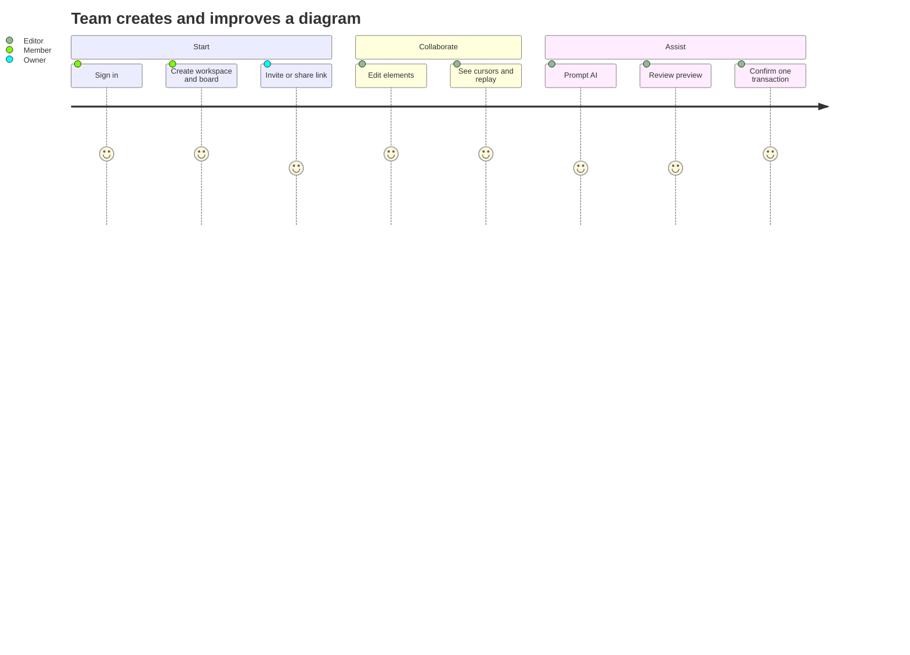
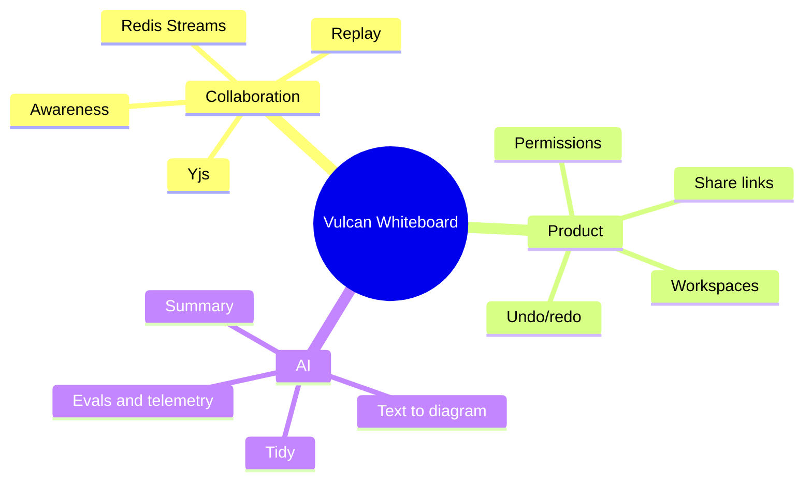
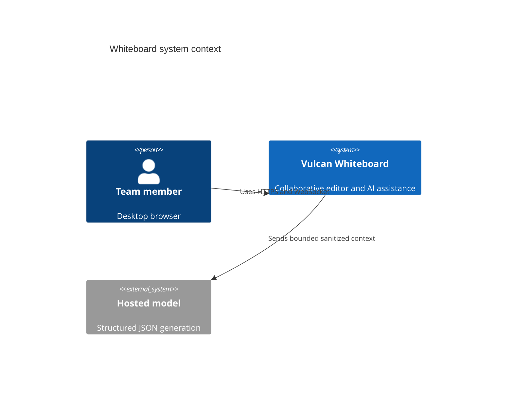
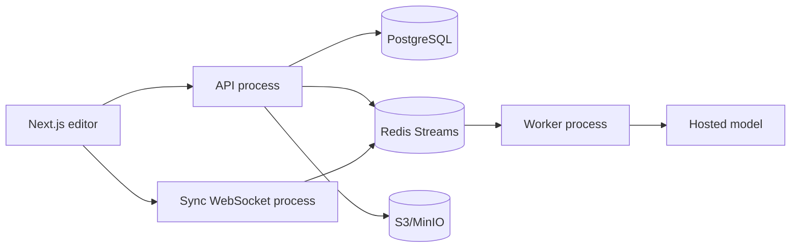
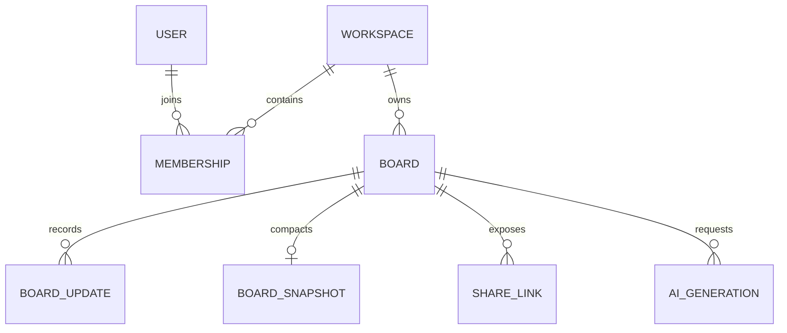
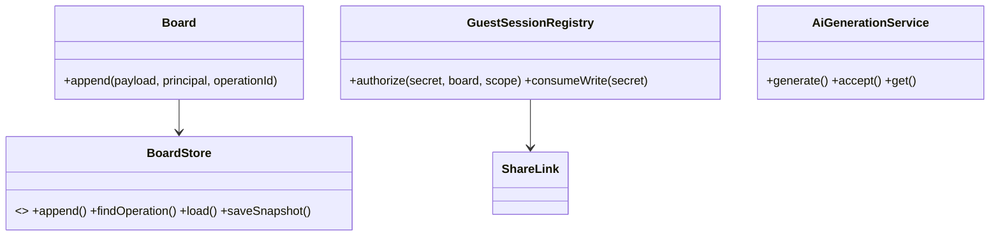

# Vulcan Collaborative Whiteboard: Final Master Document

## Part A: Product and PRD

### Executive summary
Vulcan is a web-first collaborative whiteboard for remote teams. The MVP supports 10,000 DAU, 1,000 peak WebSocket connections, 50 editors and 10,000 elements on a hot board in one `us-east` region. AI produces ordinary editable elements through the same renderer, with explicit preview and confirmation.

### Personas and stories
- Facilitator: Given an authenticated workspace, when they create a board, then members can open it and see a durable empty state.
- Designer: Given edit capability, when they draw or edit an element, then the operation is persisted before acknowledgement and appears to connected peers.
- Guest: Given a scoped unexpired link, when they open a board, then view or edit rights match the link scope and quota.
- AI-assisted editor: Given selected context, when they request a diagram, then a bounded, sanitized prompt returns a validated preview; only confirmation commits one undoable transaction.

### MoSCoW
Must: shapes, text, stickies, connectors, freehand, pan/zoom, Yjs sync, presence, workspaces, permissions, share links, Text-to-Diagram, AI Tidy, Board Summary, undo/redo, telemetry.
Should: reconnect replay, export PNG/JSON, offline draft queue, audit export.
Could: templates, comments, semantic search (v1.5), mobile editing.
Won't in MVP: autonomous mutation, fine-tuning, active/active multi-region.

### Given/When/Then acceptance
1. Given two editors on one board, when either submits an operation, then both converge to the same Yjs state within 300 ms p95.
2. Given a revoked share link, when a request arrives within 60 seconds, then it receives 403 and no write quota is consumed.
3. Given malformed model output, when validation runs, then no board mutation occurs and at most one repair request is attempted.
4. Given a confirmed AI preview, when commit runs, then exactly one attributed CRDT transaction is emitted and a second accept is rejected.

### NFRs and KPIs
Cursor p95 <100 ms; operation p95 <300 ms; board load <2 s at 1,000 elements; AI generation p95 <8 s; availability 99.5%; per-connection queue <=5 MB; presence coalescing window 150 ms; REST 60 requests/minute/user; writes 10/second/connection; two concurrent AI jobs/workspace. KPIs: weekly active teams, board creation-to-first-edit, collaboration success rate, AI schema-valid rate, acceptance rate, p95 latency, cost per generation, crash-free sessions.

### Roadmap
MVP (12 weeks): locked scope and telemetry. v1: export, comments, offline drafts, richer layouts. v2: semantic search, mobile editing, multi-region read replicas, organization controls.


*Figure 3: MVP user journey*


*Figure 4: Product mindmap*

## Part B: HLD


*Figure 5: C4 context*


*Figure 6: C4 container view*

### API surface
`POST /v1/workspaces`, `POST /v1/boards`, `GET /v1/boards/{id}`, `POST /v1/boards/{id}/updates`, `POST /v1/boards/{id}/share-links`, `GET /v1/boards/{id}/snapshot`, `POST /v1/generations`, `GET /v1/generations/{id}`, `POST /v1/generations/{id}/accept`, `/healthz`, `/readyz`. Every write has an idempotency key and every response has a request ID.

### ERD and capacity


*Figure 7: HLD ERD*

At 10K DAU, assume 10% daily editors, 100 operations/editor/day: 100,000 ops/day, average 4 KB = 400 MB/day raw. Seven-day retention is 2.8 GB before compression; snapshots every 1,000 ops or 10 MB bound recovery. One thousand sockets at 20 cursor updates/s is 20K messages/s; lossy presence and per-board fan-out keep operation traffic separate. Redis and PostgreSQL remain within the locked <$500/month envelope at MVP scale.

### Failure and threat summary
PostgreSQL failure rejects writes before acknowledgement; Redis failure degrades sync to read-only; model 429 retries with bounded backoff; malformed output gets one repair then terminal rejection. Threats include token guessing, link leakage, tenant escape, XSS, prompt injection, quota abuse, and replay. Mitigations are 256-bit random hash-only tokens, expiry/revocation, server-side capability checks, escaped rendering, sanitized context, Zod schemas, rate limits, and audit records.

## Part C: LLD

### Clean-architecture modules
Entities and policies live in `packages/domain`; ports define `BoardStore`, publisher, tracer, and model contracts; API, sync, and worker are adapters/processes; frontend depends only on HTTP/WebSocket contracts. AI modules never enter the renderer.


*Figure 8: Domain component view*

### Database schema and indexes
`users(id, email)`, `workspaces(id, name)`, `memberships(workspace_id, user_id, role)`, `boards(id, workspace_id, title)`, `board_updates(board_id, sequence, operation_id, payload)`, `board_snapshots(board_id, sequence, payload, checksum)`, `share_links(id, board_id, token_hash, scope, expires_at, revoked_at)`, `ai_generations(id, board_id, status, prompt, proposal)`, `audit_ledger(sequence, request_id, actor_id, action, payload, previous_hash, record_hash)`. Indexes cover board replay, workspace creation, token hash, generation board/time, and membership lookup; board/workspace and all child relationships cascade safely.

### Error, retry, timeout
| Failure | Response | Retry |
|---|---|---|
| 400 malformed input | structured client error | no |
| 401/403 capability failure | structured auth error | no |
| 409 idempotency conflict | conflict with request ID | no |
| 429 quota/rate limit | retry-after policy | bounded |
| Redis/DB transport error | 503/read-only degradation | transport only |
| Model 429 | queued/streaming state | max 3 attempts |
| Model schema failure | one repair then rejected | no further retry |

### Testing and folder tree
Unit, integration, property/convergence, contract, Playwright, load, and security suites are required by the release gate. Current unit/integration evidence is in `packages/domain/src/*test.ts`, `apps/api/src/index.test.ts`, `apps/sync/src/index.test.ts`, and `apps/worker/src/index.test.ts`.

```text
apps/{api,sync,worker}/src
packages/{domain,contracts}/src
frontend/{app,components}
migrations/
scripts/
docs/
```

## Part D: AI layer

Use a hosted small structured-output model for Text-to-Diagram and deterministic local layout for Tidy. Context is sanitized and capped at 8K input tokens; output is Zod-validated, finite-geometry bounded, and limited to 1,000 ordinary elements. Prompt templates separate untrusted board text from instructions and never expose tools or authorization data. Evaluate schema validity, refusal, acceptance, edit distance, latency, and cost on a golden corpus. Fallbacks are deterministic templates, cached summaries, local layout, and `NEEDS_INPUT`.

| Item | Target |
|---|---:|
| AI budget | <$200/month |
| Generation p95 | <8 s |
| Output limit | 1,000 elements |
| Repair attempts | 1 |
| Transport retries | 3 max |

## Part E: Roadmap, risks, glossary

| Weeks | Work |
|---|---|
| 1-2 | Foundation, contracts, CI |
| 2-4 | Persistence, identity, sharing |
| 3-6 | Sync, replay, presence |
| 2-8 | Canvas and permissions |
| 5-8 | AI contracts and evals |
| 9-12 | E2E, load, security, release |

| Risk | Trigger | Mitigation |
|---|---|---|
| Hot board overload | queue >5 MB | backpressure, lossy presence, board partitioning |
| CRDT growth | snapshot threshold | compact at 1,000 ops/10 MB |
| AI spend | quota burn rate | workspace quotas, caching, small model |
| Prompt injection | instruction-like board text | sanitization and schema-only output |
| Link leakage | abnormal access | hash-only tokens, expiry, revocation |
| Provider outage | model errors | deterministic fallbacks and visible failure state |

Glossary: **CRDT** conflict-free replicated data type; **Yjs** chosen CRDT library; **Awareness** lossy cursor/presence channel; **operation** durable board update; **snapshot** compacted Yjs state; **capability** server-verified scoped permission; **idempotency key** client operation identity; **AI proposal** validated ordinary elements awaiting confirmation.

### Rejected ideas
Microservices, OT, custom CRDT, direct AI rendering, autonomous mutation, fine-tuning, active/active multi-region, unbounded presence queues, and semantic search in MVP were rejected for cost, complexity, latency, safety, or locked scope reasons.
