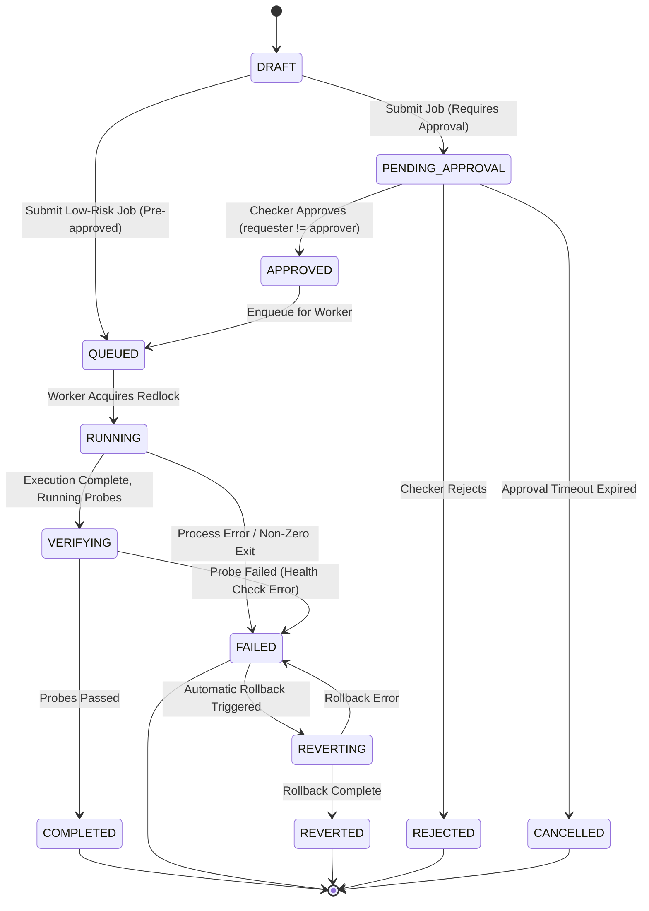

# Project Vulcan: Architectural Design & Code Logic (How Logic is Written)

This document is the deep technical blueprint of **Project Vulcan: Enterprise Automation Control Plane**. It details the software architecture, domain invariants, design patterns, data flows, and code structures governing the backend and frontend codebases.

---

## Table of Contents
1. [Architectural Philosophy & The Four Titans](#1-architectural-philosophy--the-four-titans)
2. [High-Level Clean Architecture Layering](#2-high-level-clean-architecture-layering)
3. [Layer 1: Pure Domain Model & Invariants (`backend/app/domain/`)](#3-layer-1-pure-domain-model--invariants-backendappdomain)
   - [3.1 Zero-Dependency Domain Entities](#31-zero-dependency-domain-entities)
   - [3.2 The Five Deterministic Banking Invariants](#32-the-five-deterministic-banking-invariants)
   - [3.3 The Finite State Machine (FSM) Transition Matrix](#33-the-finite-state-machine-fsm-transition-matrix)
4. [Layer 2: Abstract Ports & Inversion of Control (`backend/app/ports/`)](#4-layer-2-abstract-ports--inversion-of-control-backendappports)
   - [4.1 Repository Ports](#41-repository-ports)
   - [4.2 Distributed Systems & Infrastructure Ports](#42-distributed-systems--infrastructure-ports)
   - [4.3 AI & Integration Gateways](#43-ai--integration-gateways)
5. [Layer 3: Concrete Adapters (`backend/app/adapters/`)](#5-layer-3-concrete-adapters-backendappadapters)
   - [5.1 Distributed Target Mutex: Redis Redlock + Watchdog](#51-distributed-target-mutex-redis-redlock--watchdog)
   - [5.2 Cryptographic Merkle Tamper-Evident Audit Ledger](#52-cryptographic-merkle-tamper-evident-audit-ledger)
   - [5.3 Decoupled 10GB S3 Presigned Multipart Gateway](#53-decoupled-10gb-s3-presigned-multipart-gateway)
   - [5.4 Two-Tier Database Repositories with In-Memory Fallbacks](#54-two-tier-database-repositories-with-in-memory-fallbacks)
6. [Layer 4: Application Use Cases & Algorithms (`backend/app/use_cases/`)](#6-layer-4-application-use-cases--algorithms-backendappuse_cases)
   - [6.1 The AI Intent Resolution Pipeline (`resolve_intent.py`)](#61-the-ai-intent-resolution-pipeline-resolve_intentpy)
   - [6.2 The Execution Engine: Template Method Pipeline (`runner.py`)](#62-the-execution-engine-template-method-pipeline-runnerpy)
   - [6.3 AI SRE Log Windowing & Fast Root-Cause Extraction (`diagnose_failure.py`)](#63-ai-sre-log-windowing--fast-root-cause-extraction-diagnose_failurepy)
   - [6.4 Human Feedback Reinforcement Loop (`CHAT-26`)](#64-human-feedback-reinforcement-loop-chat-26)
7. [Layer 5: Reactive Frontend Systems (`frontend/`)](#7-layer-5-reactive-frontend-systems-frontend)
   - [7.1 Declarative State Model: $UI = f(state)$](#71-declarative-state-model-ui--fstate)
   - [7.2 The Obsidian Glass Design System](#72-the-obsidian-glass-design-system)
   - [7.3 Resilient WebSocket Streaming with Deduplicated Replay](#73-resilient-websocket-streaming-with-deduplicated-replay)
   - [7.4 WebGL-Accelerated Virtualized Terminal Rendering](#74-webgl-accelerated-virtualized-terminal-rendering)
8. [Codebase Directory Map & Module Boundaries](#8-codebase-directory-map--module-boundaries)

---

## 1. Architectural Philosophy & The Four Titans

Project Vulcan was co-designed around four rigorous architectural pillars, each championed by a distinct engineering lens:

```
                      ┌─────────────────────────────────────────────────────────┐
                      │                   PROJECT VULCAN                        │
                      │         Enterprise Automation Control Plane             │
                      └───────────────────────────┬─────────────────────────────┘
                                                  │
         ┌────────────────────────┬───────────────┴───────────────┬────────────────────────┐
         ▼                        ▼                               ▼                        ▼
┌──────────────────┐    ┌───────────────────┐           ┌───────────────────┐    ┌──────────────────┐
│   UNCLE BOB      │    │     ALEX XU       │           │  ANDREJ KARPATHY  │    │   JORDAN WALKE   │
│ Clean Arch &     │    │ Distributed Scale │           │ LLM Operating     │    │ Declarative UI & │
│ Domain Invariants│    │ & Redlock Mutex   │           │ System & Tokenomic│    │ 60 FPS Terminal  │
└──────────────────┘    └───────────────────┘           └───────────────────┘    └──────────────────┘
```

1. **Robert C. Martin ("Uncle Bob")**: Pure Domain Entities, Dependency Inversion, SOLID principles, and fail-closed Maker-Checker invariants. Frameworks (FastAPI, Redis, Postgres) are detail plugins; the core domain knows nothing about them.
2. **Alex Xu**: High-concurrency distributed systems. Capacity sizing for 75 concurrent runners, distributed target mutual exclusion (Redis Redlock + Watchdog), decoupled 10GB S3 multipart uploads, and WebSocket pub/sub backplanes.
3. **Andrej Karpathy**: The LLM Operating System. Strict 2,500-token working memory budgeting, two-stage vector + BM25 Reciprocal Rank Fusion, schema-constrained decoding (P(invalid output) $\approx 0$), 4-stage prompt injection refusal, and sub-3s AI SRE diagnostics.
4. **Jordan Walke**: Reactive UI as a pure function of state ($UI = f(state)$), Next.js 15 App Router, zero-perceived-latency optimistic updates, Obsidian Glass design token hierarchy, and hardware-accelerated WebGL `xterm.js` streaming.

---

## 2. High-Level Clean Architecture Layering

The codebase strictly adheres to the Onion / Hexagonal dependency rule: **Dependencies point inward only**.

```
┌────────────────────────────────────────────────────────────────────────┐
│ [Frameworks & Drivers] FastAPI • Postgres 16 • Redis 7.2 • Next.js 15  │
│  ┌──────────────────────────────────────────────────────────────────┐  │
│  │ [Adapters Layer] Repositories • Ansible Runner • S3 • Redlock    │  │
│  │  ┌────────────────────────────────────────────────────────────┐  │  │
│  │  │ [Use Cases / Interactors] IntentResolver • BaseJobRunner   │  │  │
│  │  │  ┌──────────────────────────────────────────────────────┐  │  │  │
│  │  │  │ [Domain Entities & Invariants]                       │  │  │  │
│  │  │  │ ExecutionJob • CatalogItem • MakerChecker • FSM     │  │  │  │
│  │  │  └──────────────────────────────────────────────────────┘  │  │  │
│  │  └────────────────────────────────────────────────────────────┘  │  │
│  └──────────────────────────────────────────────────────────────────┘  │
└────────────────────────────────────────────────────────────────────────┘
```

* **Domain (Innermost):** Defines core entities, status enums, and banking rules. Imports *zero* external libraries (Python standard library only).
* **Ports:** Abstract interfaces (`ABC`) defining contracts for persistence, execution, locks, and external integrations.
* **Use Cases:** Orchestrates application business workflows (e.g. `ExecuteJob`, `ResolveIntent`, `ApproveJob`). Depends only on Domain and Ports.
* **Adapters:** Implements ports with real external systems (PostgreSQL, Redis, MinIO S3, Ansible, Terraform).
* **Frameworks & API (Outermost):** FastAPI HTTP routers, WebSocket hubs, Uvicorn, and Next.js frontend components.

---

## 3. Layer 1: Pure Domain Model & Invariants (`backend/app/domain/`)

### 3.1 Zero-Dependency Domain Entities
Located in `backend/app/domain/entities.py` and `backend/app/domain/chat_entities.py`:
* **`ExecutionJob`**: Captures job identity, correlation ID, target host, requested parameters, execution status, maker requester ID, checker approver ID, timestamps, and log pointers.
* **`CatalogItem`**: Defines catalog automation (Ansible playbook or Terraform module), risk tier (`TIER_1` to `TIER_3`), input JSON schema, parameter constraints, and target host requirements.
* **`AuditRecord`**: Cryptographic ledger row holding sequence number, previous hash, event type, actor ID, payload hash, and timestamp.
* **`ChatFeedbackRecord`**: Operator reinforcement record capturing prompt, resolved playbook, rating enum (`thumbs_up`, `thumbs_down`, `rejected`, `corrected`), correction identifier, and qualitative comments.

---

### 3.2 The Five Deterministic Banking Invariants

Every operational action is subject to five immutable mathematical checks:

```
                                  INCOMING ACTION
                                         │
                 ┌───────────────────────┴───────────────────────┐
                 ▼                                               ▼
        [1. Maker-Checker]                              [2. State Machine]
   requester_id != approver_id?                    Is status transition legal?
                 │                                               │
                 ├───────────────────────┬───────────────────────┤
                 ▼                       ▼                       ▼
        [3. Audit Ordering]    [4. Parameter Bounds]   [5. Maintenance Window]
     Write ledger BEFORE run       Regex & range check     Is target locked or out
                                                           of approved schedule?
```

1. **Maker-Checker Enforcement (Two-Person Rule):**
   ```python
   # backend/app/domain/entities.py
   if self.requester_id == approver_id:
       raise MakerCheckerViolationError(
           f"Maker-checker violation: Requester '{self.requester_id}' cannot approve their own job."
       )
   ```
   No operator, lead, or administrator can approve a job they submitted. Attempted self-approval raises `MakerCheckerViolationError`, which translates to HTTP 403.
2. **Deterministic State Machine Validity:** Jobs can only transition along approved edges in the transition graph. Invalid transitions raise `InvalidStateTransitionError`.
3. **Write-Before-Execute Audit Commitment:** No job may begin execution before a synchronous audit record is committed to disk/database. If the audit write fails, execution is immediately aborted.
4. **Strict Parameter Bounds & Schema Validation:** Input parameters must strictly satisfy the playbook's Pydantic schema. Defaults are never guessed or silently hallucinated.
5. **Target Maintenance Window Enforcement:** Production targets (`TIER_1`) require verification against active CMDB/ServiceNow change windows. Execution attempts outside designated windows fail closed.

---

### 3.3 The Finite State Machine (FSM) Transition Matrix

Jobs transition through a strictly governed lifecycle:



---

## 4. Layer 2: Abstract Ports & Inversion of Control (`backend/app/ports/`)

The application defines abstract ports (`backend/app/ports/interfaces.py` and `repositories.py`) using Python's `abc.ABC`:

### 4.1 Repository Ports
* **`IJobRepository`**: `save_job(job)`, `get_job(id)`, `list_jobs(filter)`
* **`ICatalogRepository`**: `get_item(identifier)`, `search_items(query, top_k)`, `list_all()`
* **`IAuditLogger`**: `record_event(record) -> str`, `verify_chain_integrity() -> bool`
* **`IFeedbackRepository`**: `save_feedback(record)`, `list_feedback(filter)`, `get_feedback_stats()`, `export_rlhf_dataset()`

### 4.2 Distributed Systems & Infrastructure Ports
* **`ILockManager`**:
  ```python
  class ILockManager(ABC):
      @abstractmethod
      def acquire_lock(self, resource_id: str, ttl_ms: int = 30000) -> Optional[str]: ...
      @abstractmethod
      def release_lock(self, resource_id: str, token: str) -> bool: ...
  ```
* **`IExecutionEngine`**: `execute_job(job, params) -> ExecutionResult`
* **`IObjectStorageGateway`**: `initiate_multipart(...)`, `generate_presigned_part_url(...)`, `complete_multipart(...)`

### 4.3 AI & Integration Gateways
* **`IChatModelProvider`**: `generate(prompt, schema) -> str`
* **`IEmbeddingProvider`**: `embed_query(text) -> list[float]`
* **`IServiceNowGateway`**: `validate_change_request(chg_id) -> bool`

---

## 5. Layer 3: Concrete Adapters (`backend/app/adapters/`)

### 5.1 Distributed Target Mutex: Redis Redlock + Watchdog
To prevent two runners from applying changes to the same server simultaneously, `backend/app/adapters/redlock_adapter.py` implements the Redlock algorithm:

```
[Runner Process]
      │
      ├─► 1. acquire_lock(target_host, ttl=30s) ───► Redis: SET target_host token NX PX 30000
      │                                                   │
      ├─► 2. Lock Acquired! Spawn Watchdog Thread         ▼ (Lock Granted)
      │      [Watchdog Thread] ─── Every 10s ───► Redis: EVAL renewal_script (extends TTL to 30s)
      │
      ├─► 3. Execute Ansible/Terraform Task Pod
      │
      └─► 4. Task Complete ───► Terminate Watchdog
                                release_lock(target_host, token)
                                ───► Redis: EVAL atomic_release_script (deletes ONLY if token matches)
```

#### Atomic Lua Release Script:
```lua
if redis.call("get", KEYS[1]) == ARGV[1] then
    return redis.call("del", KEYS[1])
else
    return 0
end
```

---

### 5.2 Cryptographic Merkle Tamper-Evident Audit Ledger
Implemented in `backend/app/adapters/crypto_audit_adapter.py`. Every state modification generates an immutable audit record chained via SHA-256:

$$\text{hash}_n = \text{SHA-256}\left(\text{hash}_{n-1} \,\|\, \text{seq}_n \,\|\, \text{event\_type} \,\|\, \text{timestamp} \,\|\, \text{payload\_json}\right)$$

* **Genesis Hash:** Fixed seed string (`"VULCAN_GENESIS_ROOT_HASH_00000000"`).
* **Verification:** `verify_chain_integrity()` traverses rows from sequence 1 to $N$, re-computing hashes. If any database administrator manually edits a row (e.g. alters an approver ID or payload), the hash of that row and all subsequent rows breaks immediately.

---

### 5.3 Decoupled 10GB S3 Presigned Multipart Gateway
Implemented in `backend/app/adapters/s3_multipart_adapter.py`. Decouples the control plane API from large binary payloads (Terraform state, disk images, OS packages):
1. **Initiate:** Client calls `POST /api/v1/storage/multipart/initiate`. FastAPI generates a unique `UploadId` from MinIO.
2. **Presign Parts:** Client requests presigned URLs for 100MB chunks via `POST /api/v1/storage/multipart/presign-parts`.
3. **Direct Upload:** Client uploads chunks directly to MinIO S3 via HTTP `PUT`. No binary data passes through the Python FastAPI process.
4. **Complete:** Client calls `POST /api/v1/storage/multipart/complete` with part ETags. FastAPI notifies MinIO to assemble the final object.

---

### 5.4 Two-Tier Database Repositories with In-Memory Fallbacks
All persistence adapters (`postgres_audit_repo.py`, `feedback_repository.py`) feature a resilient two-tier architecture:
* **Tier 1 (PostgreSQL 16):** Uses connection pools with automatic table initialization (`CREATE TABLE IF NOT EXISTS`).
* **Tier 2 (Thread-Safe In-Memory Cache):** Protected by `threading.RLock`. If the database is unreachable or during unit tests, the repository seamlessly falls back to memory, ensuring 100% test isolation and offline capability.

---

## 6. Layer 4: Application Use Cases & Algorithms (`backend/app/use_cases/`)

### 6.1 The AI Intent Resolution Pipeline (`resolve_intent.py`)

The conversational copilot runs a deterministic 5-stage pipeline on every prompt:

```
USER PROMPT
    │
    ▼
[ Stage 1: 4-Stage Prompt Injection & Adversarial Refusal Gate ]
    ├── Check 1: System prompt extraction regex ("ignore previous instructions", "system prompt")
    ├── Check 2: Command injection characters ("; rm -rf", "| sh", "`curl`")
    ├── Check 3: Roleplay & jailbreak templates ("DAN mode", "pretend you are")
    └── Check 4: Out-of-catalog adversarial refusal (similarity < refusal_threshold)
    │   └── IF VIOLATION ──► Terminate immediately with REJECTED & exact safety citation
    ▼
[ Stage 2: Two-Stage Hybrid Search & Reciprocal Rank Fusion (RRF) ]
    ├── Branch A: Dense Vector Semantic Search (pgvector HNSW Cosine Similarity)
    ├── Branch B: Sparse Lexical Search (BM25 Keyword Frequency)
    └── RRF Scoring: RRF(item) = 1/(60 + Rank_Vector) + 1/(60 + Rank_BM25)
    │
    ▼
[ Stage 3: Working Memory Token Budgeting (2,500 Token Ceiling) ]
    ├── Token budget formula: Context = Prompt (200t) + Top-3 Playbook Schemas (1,200t) + Turn History (600t)
    └── Compaction: History is automatically compacted if budget exceeds 2,500 tokens
    │
    ▼
[ Stage 4: Pydantic Schema-Constrained Slot Filling ]
    ├── LLM receives only candidate playbook schemas
    └── Model fills parameter values strictly matching type signatures (string, int, enum, bool)
    │
    ▼
[ Stage 5: Deterministic Post-Resolution Validation ]
    ├── Parameter regex validation
    ├── Missing required parameter detection (triggers NEEDS_INPUT)
    └── CMDB / ServiceNow ticket hydration
```

---

### 6.2 The Execution Engine: Template Method Pipeline (`runner.py`)

Every execution follows the `BaseJobRunner` template pattern:

```python
class BaseJobRunner(ABC):
    def run(self, job: ExecutionJob) -> ExecutionResult:
        self.pre_flight_checks(job)          # 1. Bounds, permissions, window
        token = self.acquire_target_lock(job) # 2. Redlock target mutex
        self.record_audit_event("RUN_START") # 3. Synchronous write-before-run
        try:
            result = self.execute_task(job)   # 4. Ansible/Terraform subprocess
            self.run_post_flight_probes(job)  # 5. Health verification probes
            self.record_audit_event("RUN_OK")
            return result
        except Exception as err:
            self.record_audit_event("RUN_FAIL", err)
            self.trigger_ai_diagnostics(job)  # 6. SRE log window analysis
            self.attempt_rollback(job)        # 7. Compensation rollback
            raise
        finally:
            self.release_target_lock(token)   # 8. Guaranteed lock release
```

---

### 6.3 AI SRE Log Windowing & Fast Root-Cause Extraction (`diagnose_failure.py`)
When a playbook execution fails:
1. **Windowing Extraction:** The engine avoids ingesting 10,000 lines of logs into LLM context. Instead, it extracts exactly 50 lines surrounding the failure point (30 lines before the error, the failure line, and 19 lines after).
2. **Fast Root-Cause Extraction:** The window is processed via a high-speed inference prompt (latency $<3$ seconds).
3. **Structured Diagnostic Output:**
   * `failure_category`: Enum (e.g. `AUTHENTICATION_ERROR`, `DISK_FULL`, `RESOURCE_LOCKED`)
   * `root_cause`: Plain English summary of why the task failed.
   * `failing_task`: Exact Ansible task or Terraform resource name that failed.
   * `recommended_action`: Proposed remediation playbook.

---

### 6.4 Human Feedback Reinforcement Loop (`CHAT-26`)
* Captures operator evaluations on every copilot intent resolution.
* Categorizes ratings into `thumbs_up`, `thumbs_down`, `rejected`, and `corrected`.
* Formats pairs into preference datasets for Direct Preference Optimization (DPO):
  * `chosen`: Target playbook selected by human expert.
  * `rejected`: Playbook originally suggested by the model.

---

## 7. Layer 5: Reactive Frontend Systems (`frontend/`)

### 7.1 Declarative State Model: $UI = f(state)$
The Next.js 15 Obsidian Glass console operates as a pure declarative projection of server state:
* State flows unidirectionally from the FastAPI backend via REST and WebSockets.
* Components never compute enterprise policy; the backend returns `allowed`, `disabled_reason`, and `required_role` as data.
* Optimistic UI updates provide zero-perceived latency (e.g. feedback confirmations and approval button loading states).

---

### 7.2 The Obsidian Glass Design System
Tailored for mission-critical NOC/SOC operations with high legibility and minimal eye strain:
* **Background Canvas:** `#07090E` (Deep Space Obsidian)
* **Card & Surface Background:** `#0C101A` with 80% opacity and 12px backdrop blur (Acrylic Glass)
* **Borders:** `rgba(255, 255, 255, 0.08)`
* **Primary Accent:** Neon Cyan (`#00F0FF`) for telemetry and active operations
* **Status Accents:**
  * Emerald (`#00FF88`): Completed / Healthy / Verified
  * Amber (`#FFB800`): Pending Approval / Warning
  * Rose (`#FF3366`): Failed / Rejected / Security Violation
* **Typography:** Geist Sans for interface elements, JetBrains Mono for terminals, metrics, and code blocks.

---

### 7.3 Resilient WebSocket Streaming with Deduplicated Replay
Implemented in `frontend/hooks/useJobStream.ts`:
* **Exponential Backoff Reconnect:** Automatically reconnects upon network drops (1s, 2s, 4s, 8s, capped at 30s).
* **Last Sequence Replay:** Sends `?last_seq=X` upon reconnecting. The backend WebSocket hub replays missed events from a Redis buffer, guaranteeing zero dropped log lines.
* **Client Deduplication:** Tracks received sequence numbers in a local Set to eliminate duplicate lines during reconnections.

---

### 7.4 WebGL-Accelerated Virtualized Terminal Rendering
Implemented in `frontend/components/Terminal.tsx`:
* Leverages `@xterm/xterm` with `@xterm/addon-webgl` for GPU-rendered 60 FPS performance.
* Supports high-throughput log streams ($>10,000$ lines/second) without browser UI freezing.
* Detects user scroll position to pause auto-scrolling during forensic inspection.

---

## 8. Codebase Directory Map & Module Boundaries

```
vulcan-control-plane/
├── backend/
│   ├── app/
│   │   ├── domain/                  # PURE DOMAIN: Entities, enums, Maker-Checker invariants
│   │   │   ├── entities.py          # Job, CatalogItem, AuditRecord, State Machine
│   │   │   ├── chat_entities.py     # ChatFeedbackRecord, ChatIntentResult
│   │   │   └── exceptions.py        # Domain exceptions (MakerCheckerViolationError, etc.)
│   │   ├── ports/                   # ABSTRACT PORTS: Interfaces & contracts
│   │   │   ├── interfaces.py        # IExecutionEngine, ILockManager, IAuditLogger
│   │   │   └── repositories.py      # IJobRepository, IFeedbackRepository
│   │   ├── adapters/                # CONCRETE ADAPTERS: Infrastructure & driver implementations
│   │   │   ├── redlock_adapter.py   # Redis Redlock + Watchdog thread
│   │   │   ├── crypto_audit_adapter.py # SHA-256 Merkle hash chain
│   │   │   ├── feedback_repository.py # PostgreSQL + In-Memory Feedback Adapter
│   │   │   ├── postgres_audit_repo.py # PostgreSQL Audit Ledger
│   │   │   ├── s3_multipart_adapter.py # 10GB S3 Presigned Multipart Gateway
│   │   │   └── simulation_adapter.py # Ephemeral runner simulation
│   │   ├── use_cases/               # APPLICATION INTERACTORS: Orchestration & logic
│   │   │   ├── runner.py            # BaseJobRunner Template Method
│   │   │   ├── resolve_intent.py    # Hybrid RRF, Prompt Injection & Slot Filling
│   │   │   └── diagnose_failure.py  # 50-line log window SRE diagnostics
│   │   ├── api/                     # FASTAPI BOUNDARY: HTTP & WebSocket endpoints
│   │   │   ├── server.py            # FastAPI app assembly, lifespan & CORS
│   │   │   ├── routes.py            # Job CRUD, Maker-Checker approval endpoints
│   │   │   ├── chat_routes.py       # Intent resolution & RLHF feedback endpoints
│   │   │   └── websockets.py        # Real-time WebSocket hub & replay buffer
│   │   └── config.py                # Dependency Injection Container (AppContainer)
│   └── tests/                       # 29 PyTest suites verifying 100% of banking invariants
│
├── frontend/                        # REACT 19 & NEXT.JS 15 OBSIDIAN GLASS CONSOLE
│   ├── app/                         # App Router (16 static routes)
│   ├── components/                  # Bento Grid, ChatAssistant, Terminal, MakerCheckerDeck
│   ├── hooks/                       # useJobStream (WebSocket with replay & backoff)
│   └── lib/                         # api.ts (HTTP client), env.ts (Dynamic URL resolution)
│
├── deploy/                          # INFRASTRUCTURE & DOCKER TOPOLOGIES
│   ├── docker-compose.yml           # PostgreSQL 16 pgvector, Redis 7.2, MinIO, Backend, Frontend
│   ├── .env.example                 # 12-Factor environment variable blueprint
│   └── sandbox/                     # OpenSSH execution target pod
│
└── docs/                            # ARCHITECTURAL DOCUMENTATION & AUDIT REGISTERS
```
