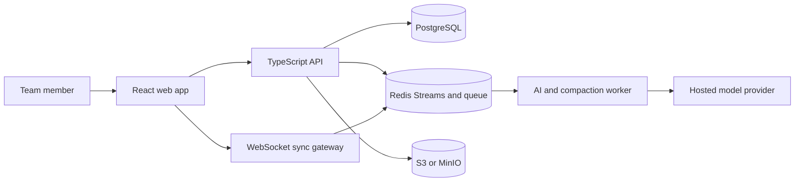
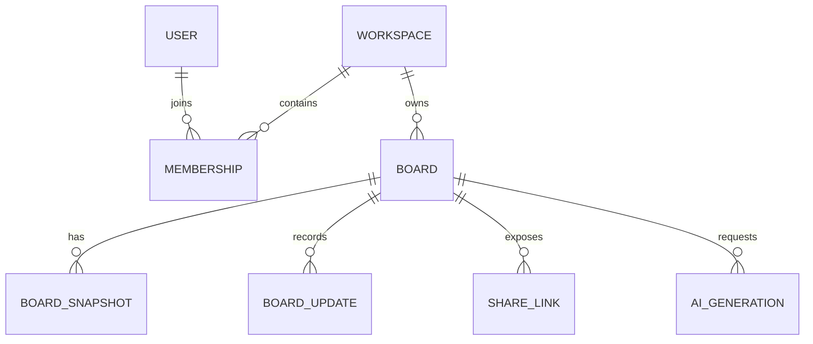

# Collaborative Whiteboard with AI-Assisted Diagramming

## Status

This is the design-studio master specification for the whiteboard product defined in the supplied brief. It is separate from the existing Project Vulcan automation-control-plane documents.

## Locked Assumptions

- 10K DAU, 1K peak WebSocket connections, 50 editors and 10K elements per hot board.
- Web-first desktop MVP; mobile is read-only; single `us-east` region.
- 4–6 engineers, 12-week MVP, infrastructure under $500/month, AI under $200/month.
- Freemium teams, GDPR basics, moderate business-data sensitivity.

## Locked Decisions

| ID | Decision |
|---|---|
| D1 | AI produces ordinary editable elements through one render path. |
| D2 | Freehand is client-decimated to about 15 points/second and simplified on stroke end. |
| D3 | Cursor p95 <100 ms, operation p95 <300 ms, board load <2 s at 1K elements. |
| D4 | Semantic board search is deferred to v1.5; generation telemetry ships in MVP. |
| D5 | MVP availability target is 99.5%; mobile editing is deferred. |
| D6 | AI generation p95 <8 s with streamed progress; no fine-tuning in MVP. |
| D7 | Modular monolith repository with separate API, sync, and worker processes. |
| D8 | Yjs CRDT with Awareness for collaboration. |
| D9 | PostgreSQL snapshots plus append-only Yjs update log. |
| D10 | Node.js/TypeScript backend and React/Next.js frontend. |
| D11 | Redis Streams with sequence IDs for replayable fan-out. |
| D12 | AI receives bounded sanitized context and emits validated proposals only. |
| D13 | Share links are hashed, scoped, expiring, and revocable. |

## Specialist Ownership

| Specialist | Ownership |
|---|---|
| Uncle Bob | Domain model, clean architecture, invariants, TDD |
| Alex | CRDT persistence, fan-out, capacity, failure modes, infrastructure |
| Andrej | Model pipeline, evaluation, context selection, AI cost controls |
| Jordan | Canvas rendering, declarative UI, accessibility, collaboration UX |
| Platform SRE | Identity, deployment, observability, release readiness |
| QA Red Team | Independent security, load, chaos, and end-to-end verification |

## Product Scope

MVP includes shapes, text, sticky notes, connectors, freehand, pan/zoom, Yjs synchronization, live cursors, workspaces, permissions, scoped sharing, Text→Diagram, AI Tidy, Board Summary, undo/redo, and usage telemetry. Semantic search, mobile editing, fine-tuning, multi-region active/active, and autonomous mutation are out of scope.

## Architecture



*Figure 1: Whiteboard MVP container architecture*



*Figure 2: Persistence relationships*

## Data and API Contracts

Tables: `users`, `workspaces`, `memberships`, `boards`, `board_snapshots`, `board_updates`, `share_links`, and `ai_generations`. Index `board_updates(board_id, sequence)`, `boards(workspace_id, created_at)`, `share_links(token_hash)`, and `ai_generations(board_id, created_at)`. Compact at 1,000 updates or 10 MB; retain seven days of raw updates plus durable snapshots and audit metadata.

Core endpoints:

```text
POST /v1/workspaces
POST /v1/boards
GET  /v1/boards/{board_id}
POST /v1/boards/{board_id}/share-links
POST /v1/generations
GET  /v1/generations/{generation_id}
POST /v1/generations/{generation_id}/accept
GET  /v1/boards/{board_id}/snapshot
GET  /healthz
GET  /readyz
```

Every write carries an idempotency key. Every response includes a request ID. Authorization is evaluated server-side for every board read, update append, snapshot request, and generation.

## AI Design

Text→Diagram uses a hosted small model with structured JSON output. AI Tidy uses deterministic ELK/dagre-style layout and needs no model. Board Summary uses a bounded representation of visible or explicitly selected elements and is read-only. Context is capped at 8K input tokens, secrets are redacted, output is validated with Zod, geometry and element-count limits are enforced, and accepted output becomes one undoable CRDT transaction.

Fallbacks are deterministic templates, local layout, cached summaries, and `NEEDS_INPUT`. Track schema-valid rate, acceptance, edit distance, refusal rate, p95 latency, tokens, and cost. Enforce workspace quotas and concurrency limits to keep AI spend below $200/month.

## Security and Reliability

- Share tokens are 256-bit random values; only hashes are stored.
- Edit links create short-lived capability sessions; view and edit scopes differ.
- Board text is untrusted model input; models receive no tools or authorization data.
- Redis loss degrades collaboration to read-only; acknowledged updates are durable before acknowledgement.
- Per-connection queues are bounded at 5 MB; stale presence is dropped after 150 ms.
- Layered limits: 60 REST requests/minute/user, 10 board writes/second/connection, two concurrent AI jobs/workspace.
- OpenTelemetry correlates `request_id`, `board_id`, `operation_id`, and `generation_id`.

## Testing and Release Gates

Unit tests cover domain and permissions. Property tests prove CRDT convergence. Integration tests run PostgreSQL, Redis, and MinIO. Contract tests cover model and identity adapters. Playwright covers create/share/edit, AI preview/accept, reconnect, reject, and revoked-link flows. Load tests target 1,000 connections and 50-editor boards. Security tests cover XSS, tenant escape, token guessing, prompt injection, and quota abuse.

MVP ships after correctness, safety, reliability, performance, security, and operability gates pass. The 12-week sequence is: foundation (weeks 1–2), persistence/auth (2–4), sync and presence (3–6), canvas and sharing (2–8), AI contracts/evals (5–8), and end-to-end/load/security hardening (9–12).

## Risks

| Risk | Mitigation |
|---|---|
| CRDT memory growth | Snapshot thresholds and soak tests |
| Hot-board overload | Board partitioning and bounded queues |
| AI budget overrun | Quotas, caching, small models |
| Prompt injection | Untrusted context and schema-only output |
| Share-link leakage | Expiry, revocation, hashed tokens |
| Renderer misses FPS | Konva/Pixi benchmark at 10K elements |
| Provider outage | Deterministic templates and local Tidy |
| Scope expansion | Locked MoSCoW list and weekly gate review |

## Open Questions

1. Do edit links require verified email or authenticated identity?
2. What exact context-selection rule powers Text→Diagram?
3. Should all AI previews require explicit confirmation in v1?
4. What offline edit queue size triggers read-only mode?
5. Which Redis retention policy meets the recovery objective?

This document is the implementation-facing whiteboard design. Existing Vulcan automation documents remain authoritative for the separate enterprise automation product.
